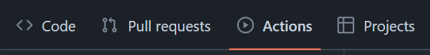
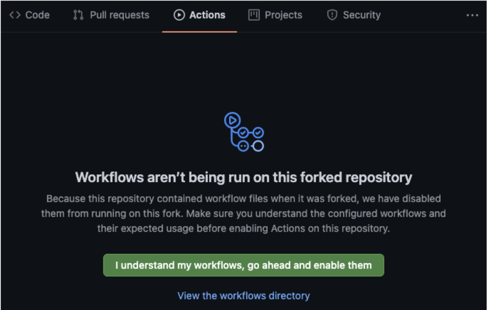

# Automated Tests for Assignments

Programming assignments managed via GitHub and GitHub Classroom are configured with automated tests.

These tests help instructors validate submissions, but also helps students identify issues while they are working on the assignment.

How extensive the test suites are vary by assignment. An automated test suite may pass but the submission may not satisfy all the requirements of the assignment. Students should not rely soley on automated tests to validate their work.

Automated tests must pass and are included as part of assignment grading criteria. Students should always verify the automated tests pass for the latest commit pushed to their assignment repository.

## Viewing test runs

Open your assignemnt repository in GitHub. This repository is created when you accept an assignment via the GitHub Classroom link.

Open the **Actions** tab.

Each commit to your repository's main branch will trigger the **Automated Tests** workflow to run. You can see a list of the previous workflow runs and their status.

Click on a workflow run to inspect it.

Some assignments have a dedicated test program, others use GitHub actions from [classroom-resources](https://github.com/classroom-resources) to build and run the student submissions with various inputs and expected outputs.

## Enable actions for forks if needed

GitHub Classroom _should_ enable actions for your forked assignment repository automatically. If it doesn't, simply click the button to enable workflows in your assignment repository within the **Actions** tab.

Once enabled, the workflows will run when you push new commits to your repository. You can also trigger workflows manually using the GitHub UI (see [here](https://docs.github.com/en/actions/using-workflows/manually-running-a-workflow)).

## Automated test environment

Automated tests are run within a Linux environment. If you are developing on Windows using the MSVC compiler (Visual Studio), there may be some differences that cause errors in the automated test environment but not in your local development environment.

While these errors will be uncommon, you must resolve them to allow the automated tests to build and pass successfully. There are cases where the MSVC compiler supports a non-standard feature of some kind.

If you encounter an error with the automated tests you cannot resolve, raise the issue with the course instructor.
