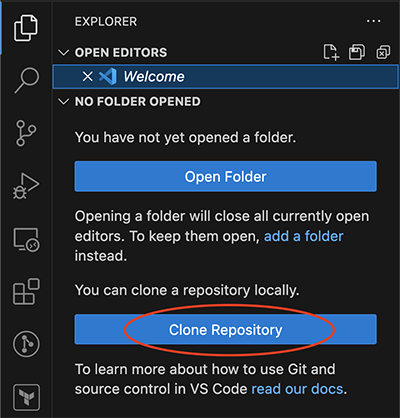
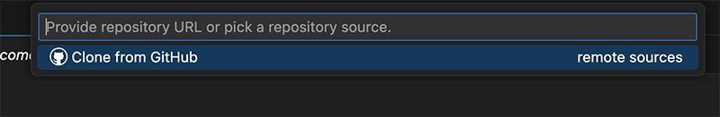
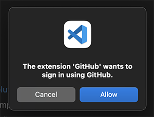

# Using Visual Studio Code on Mac

## Install Clang

Check if Clang is installed on your Mac. To do this, open a terminal window and enter:

```
clang --version
```

If Clang is installed, you will see the version number that is installed.


If Clang is not installed, you will see a message indicating the command was not found. In that case, enter the following command in the terminal window:

```
xcode-select --install
```

Follow the instructions on screen to install the command line developer tools. This will install Clang.

## Install CMake

Follow [these instructions](../cmake-on-mac.md) to make sure you have CMake installed.

## Configure Git Identity

### Name

Check to see if your Git user name is set:

```
git config --get user.name
```

If there is no value, set a name using this command (replace `John Doe` with the name you want to associate with your commits):

```
git config --global user.name "John Doe"
```

### Email

Check to see if your Git user email is set:

```
git config --get user.email
```

If there is no value, set the email using this command (replace `johndoe@example.com` with the email you want to associate with your commits):

```
git config --global user.email johndoe@example.com
```

## Install Visual Studio Code

Install [Visual Studio Code for Mac](https://code.visualstudio.com/docs/setup/mac).

## Clone repository

Open VS Code. If this is not your first time running VS Code, make sure you open a new window.

Open the **Explorer** panel on the left side of the window and click **Clone Repository**.



At the top of the screen, click **Clone from GitHub**.



If prompted, click **Allow** to allow the GitHub extension to sign in.



A browser window will open. Follow the instructions to sign in to GitHub using your GitHub account. Once complete, you should be returned back to VS Code. You should see a box at the top of VS Code to search for a GitHub repository to clone. If you don't see this, start over by clicking the **Clone Repository** button in the **Explorer** panel.

Search for your assignment repository in the box at the top of the window. Your repository name will be something like `eu-cpsc111/24fa-1-hello-world-your-name`. When the repository appears, select it from the list.

Pick a directory to clone the repository to on your local computer. This can be anywhere you want.

VS Code will clone the repository and open the folder that it was cloned into. When prompted, choose the option to trust the authors.

## Install extensions

Open the **Extensions** panel in VS Code. Install the following two extensions:

- C/C++ (search for `ms-vscode.cpptools`)
- CMake Tools (search for `ms-vscode.cmake-tools`)

## Configure CMake

Open the **CMake Tools** panel. The icon looks like:


In the **CMake Tools** panel, find the **Configure** section and click the button to **Select a Kit**.


Select the Clang option from the list at the top of the window. If you don't see a Clang option, make sure Clang is installed (see instructions at the top of this document).


In the **CMake Tools** panel, find the **Build** section and click the button to change the build target.


Select the `hello-world` option from the list at the top of the window.


## Build and run

You are now ready to build and run the program. Open the `main.cpp` file from the **Explorer** panel. A text editor tab should open and show the file contents.

At the bottom of the VS Code window, click the **Build** button.


If the build succeeds, you will see something like "Build finished with exit code 0" in the output window. If the build fails, switch to the **Problems** tab of the output panel and inspect any errors that are shown.

Once the build succeeds, you can run the program by clicking the play button at the bottom of the VS Code window.


