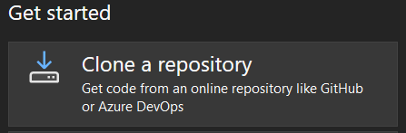
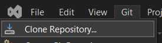
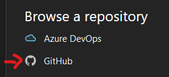
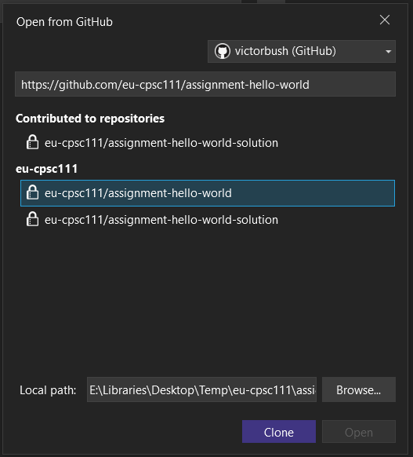
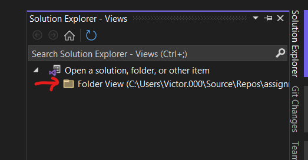
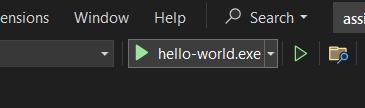

# Using Visual Studio 2022 on Windows

## Install Visual Studio 2022 Community

Download and install the _community_ edition of Visual Studio 2022 [here](https://visualstudio.microsoft.com/vs/community/). The community edition is free.

In the Visual Studio Installer, make sure you check the **Desktop development with C++** workload. If you've previously installed Visual Studio but did not check this box, you can reopen the Visual Studio Installer and modify the existing installation to include this workload.

## Clone repository

_Note: Part of the instructions below were copied from Microsoft's [documentation](https://learn.microsoft.com/en-us/visualstudio/version-control/git-clone-repository?view=vs-2022)._

Open Visual Studio 2022.

From the startup screen, click **Clone a repository**.

If the startup screen is not visible, you can use the **Git** menu at the top of the main Visual Studio window to clone a repository.

In the **Clone a repository** window click the **GitHub** option.

Use the **Sign in** dropdown menu to sign in to GitHub.

You may need to authorize Visual Studio with your GitHub account.

Proceed to authorize your account. Once you are successfully signed in, you should return to the **Open from GitHub** window within Visual Studio. Select your assignment repository from the list or enter the repository URL manually. Your repository will be named someting like `eu-cpsc111/24fa-1-hello-world-your-name`.

You can select where you want to clone the repository to on your local computer or use the default path. When you are ready, click the **Clone** button.

Once the repository is cloned, open the **Solution Explorer** and double-click the **Folder View** item in the list.

After the folder loads in Visual Studio, the **Solution Explorer** will show a list of files within the repository on your local PC.

## Build and run

In the **Solution Explorer**, double click the `main.cpp` file to open it.

Click the green play button in the toolbar to build and run the program.

If the button does not say `hello-world`, click the arrow on the right side of the button and select it from the list.
