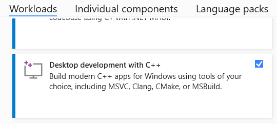
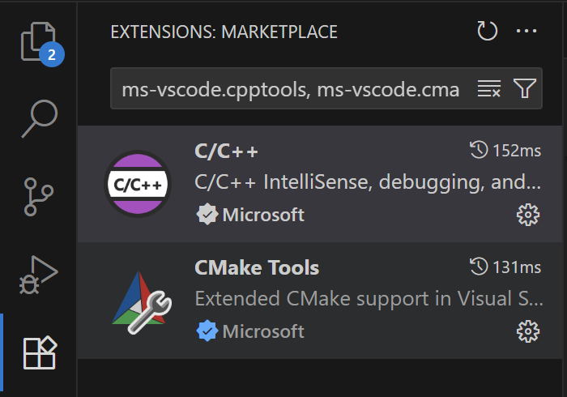

# Visual Studio Code on Windows

**Note:** CPSC 111 uses GitHub Codespaces for all programming activities. The Codespaces for the course are preconfigured with any necessary tools.

The instructions here describe installing the tools to develop code on your own computer. Students are encouraged to try this out if they are interested, but this is not required for any course work.

## Visual Studio vs VS Code

The instructions here target using VS Code for development. The reason for this is to have the same set of instructions both Windows and macOS. VS Code runs on both systems; Visual Studio 2022 does not.

**Visual Studio 2026** and **Visual Studio Code** (often abbreviated VS Code) are _two separate applications_. They are not the same thing!

On Windows, however, in order to use VS Code to develop C/C++ programs, _you must also install Visual Studio 2026_. Visual Studio 2026 includes the MSVC C/C++ compiler. VS Code does not include any compiler.

If you prefer, you can use Visual Studio 2026 directly without using VS Code.

## Install Visual Studio 2026 Community

**You must install this to get the MSVC C/C++ compiler.**

Download and install the _community_ edition of Visual Studio 2026 [here](https://visualstudio.microsoft.com/vs/community/). The community edition is free.

In the Visual Studio Installer, make sure you check the **Desktop development with C++** workload. If you've previously installed Visual Studio but did not check this box, you can reopen the Visual Studio Installer and modify the existing installation to include this workload.

## Install Visual Studio Code

Download and install Visual Studio Code [here](https://code.visualstudio.com/docs/setup/windows).

## Install VS Code Extensions

Open the **Extensions** panel in VS Code. Install the following two extensions:

- C/C++ (search for `ms-vscode.cpptools`)
- CMake Tools (search for `ms-vscode.cmake-tools`)

## Install GitHub Desktop

Download and install the GitHub Desktop app [here](https://github.com/apps/desktop).

You will need a GitHub account. If you don't have one, create one now.
