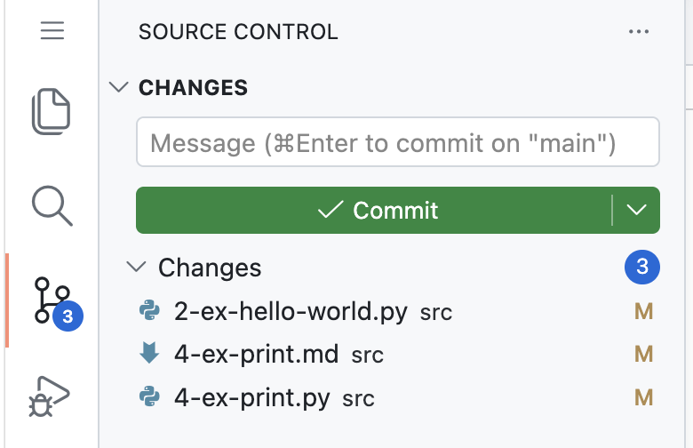
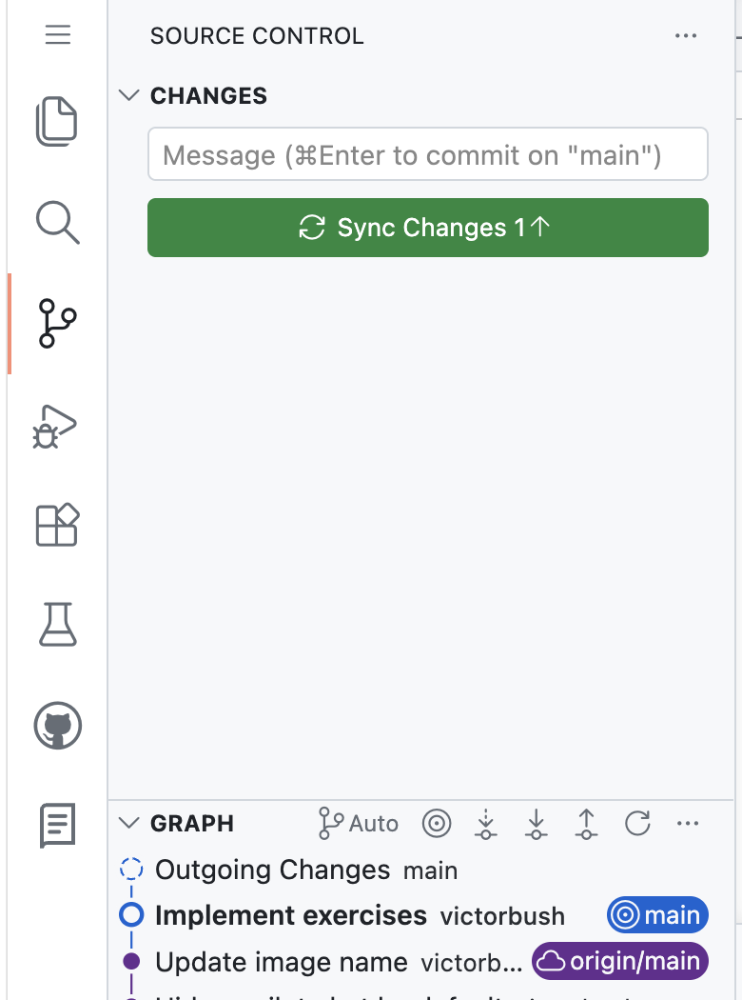

# Lecture: Introduction to Python

## Topics

- Introduction to Python
- Basic output (`print()`, strings, spaces, numbers)
- Simple expressions
- Introduction to Git

## Recap

So far we've looked at:

- Algorithms (a series of steps to solve a problem).
- Visual programming and some core programming building blocks (branches, loops, variables, functions).

Now:

- Implement algorithms using Python code.

## Programming Languages

Python is a programming language.

A computer takes a list of instructions you want to execute. You need to convert your algorithm steps into instructions the computer can understand.

Most humans don't speak the same language that a computer speaks. A computer only understands binary code. It is possible to write instructions in raw binary code, but this would be very tedious.

Instead, we use programming languages that have more human readable instructions.

A **compiler** is used to translate the programming language code into machine code the computer can understand.

The Python language comes with a compiler to do this translation for us. You may see referred to as the Python interpreter.

## Exercise

Do the "Hello, world!" exercise.

## Basic Output

### The `print()` Function

Recall the hello world program:

```python
print("Hello, world!")
```

`print` is a function built-in to Python. Think of it like a custom block in Scratch.

When you use a function in your code, we say that you "call" that function.

_Yelling at function:_ "Hey function, go do your thing!"

Functions are abstractions. They have their own list of instructions for the computer to execute. When you call a function, you don't have to know all the details about how it works.

Some functions accept **arguments**. An argument is a value that you hand off to the function to use. Some functions don't accept any arguments. Some functions code a specific number of arguments.

You _pass_ an argument to a function when you call it by specifying it inside the parentheses.

```python
print("Hello, world!")
```

In this example, `"Hello, world!"` is the argument.

You can have multiple arguments separated by commas:

```python
print("Hello", "world", "!")
```

Pay close attention to the difference!

### Multiple Statements

Each line of a Python program is a **statement**. You have one statement per line. You can have multiple statements in a program. Statements are executed in order from top to bottom.

```python
print("Hello")
print("world")
print("!")
```

Compare the output of the program above with the original hello world program.

Whenever you call `print()`, Python will print out the value(s) you specify, and then add a newline character at the end of the line. This ends the output line and starts a new line below.

### Strings

Consider these Python statements:

```python
print("abc") # valid
print(abc)   # INVALID
```

A **string** contains a sequence of characters. In Python, if you want a string, you have to surround the string with double quotes.

```python
print(abc)
```

This is invalid, because `abc` is missing double quotes. Python doesn't know what `abc` means, so it gives an error:

```
NameError: name 'abc' is not defined. Did you mean: 'abs'? Or did you forget to import 'abc'?
```

We'll see later how we can tell Python what `abc` means.

If we truly want to print out the string "abc", we have to use double quotes.

### Spaces

Do spaces matter?

```python
print("abc")
print(" abc ")
print(" a b c ")
print("a    bc")
```

Whatever is contained _within_ the double quotes is considered part of the string. This includes spaces. Spaces inside the quotes matter!

```python
print( "abc" )
print(         "abc" )
print(   "abc"        )
```

Spaces _outside_ the quotes do not matter (usually). We use an auto-formatting tool in this workspace which will remove extra, unnecessary spaces automatically.

One place that spaces matter is at the _beginning_ of a line.

What's wrong with the code below?

```python
print("abc")
 print("def")
print("ghi")
```

There is an extra space in front of the second line.

Attention to minor details like this is vital for anyone writing computer code!

### Numbers

Try this:

```python
print(123)   # This is arg is a number
print("123") # This is arg is a string
```

Numbers do not have quotes around them. The `print()` function automatically converts number arguments into strings to be displayed.

You can also do some basic arithmetic. Try to run these Python statements.

```python
print(1 + 2)
print(2 * 3)
print(5 - 4)
print(10 / 2)
```

The code `1 + 2` or `5 - 1` are called _expressions_. We'll look more at expressions later.

## Git

To submit your homework and assignments in this class, you must use Git.

Git is a version control program. It let's you track changes to your files over time.

You will **commit** your changes using Git and **push** them to GitHub.

**WARNING: If you do not commit and push your changes to GitHub, you will not get credit for assignments!**

### Commit

Use the **Source Control** panel in VS Code to view your changes.



Type a description of your changes in the message box. Then click **Commit**.

If prompted, click **Yes** to stage all changes.

**IMPORTANT**: Your changes have been committed, but not pushed! This means the changes are tracked in your workspace, but not in GitHub.

**You must push your changes to GitHub to get credit!**

You also risk losing your changes if your Codespace is deleted.



Click the **Sync Changes** button to push your changes to GitHub.

The graph at the bottom of the Source Control panel will update to reflect the changes after the sync has completed.

## Homework

Complete the remaining exercises.

**Commit and push to GitHub.**

Ensure the automated tests pass.

## Review Questions

1. What is output (i.e., what is displayed) by the following code?

   ```python
   print(10 * 20)
   ```

1. What is output by the following code?

   ```python
   print("Hello")
   print("world")
   print("!")
   ```

1. What is output by the following code?

   ```python
   print("Welcome to", "Evangel", "   University   " + "!")
   ```

1. What is output by the following code?

   ```python
   print("Welcome to",       "Evangel",        "University!")
   ```

1. What is output by the following code?

   ```python
   print("'Nice to meet you', she said.")
   ```

1. What is output by the following code?

   ```python
   print('Do I "look the part"?')
   ```

1. What is wrong with this code?

   ```python
   print(The cake is a lie)
   ```
