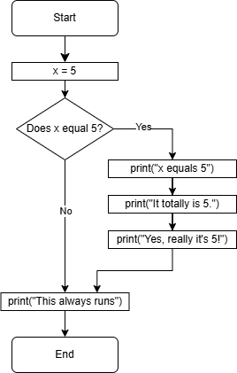
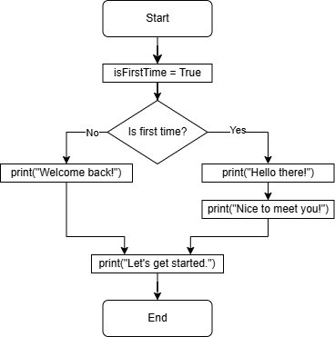

# Lecture: If

## Assigned Reading

- _[The Coder’s Apprentice](https://www.spronck.net/pythonbook/pythonbook.pdf)_
  - Chapter 6 - Conditions
    - 6.1.2 Comparisons
    - 6.2 Conditional statements
    - 6.3 Early exits

## Topics

- Boolean comparisons
- If statements

## Comparisons

With an understanding of Boolean logic, we can translate that into making comparisons. This is a frequent task when asking those yes/no questions used in decision making.

- Did the user enter a number less than 10?
- Is the variable `count` greater than or equal to 50?
- Is the user's name equal to "Alice"?
- Is the user's name _not_ equal to "Alice"?
- Is there time left on the clock?
- etc.

We can use Boolean comparison operations in Python to ask these questions and get a Boolean True/False response.

Here are the available operations (copied from the textbook):

```
==  equal to
!=  not equal
<   less than
<=  less than or equal to
>=  greater than or equal to
>   greater than
```

You can compare numbers (integer and floating point) and you can compare strings.

Review each of the following comparisons:

```python
print("1.", 2 < 5)
print("2.", 2 <= 5)
print("3.", 3 > 3)
print("4.", 3 >= 3)
print("5.", 3 == 3.0)
print("6.", 3 == "3")
print("7.", "syntax" == "syntax")
print("8.", "syntax" == "semantics")
print("9.", "syntax" == " syntax")
print("10.", "Python" != "rubbish")
print("11.", "Python" > "Perl")
print("12.", "banana" < "orange")
print("13.", "banana" < "Orange")
```

What's up with comparing strings with `<` or `>=`, etc.?

- A string is a sequence of characters.
- A character is stored as a number.
- Each possible character is assigned a number. This is called _encoding_. A character is encoded to a number.
- ASCII and Unicode are character encoding schemes.
- When comparing strings, each character's numeric value is compared.
  - 'A' maps to 65, 'Z' to 90, 'a' to 97, 'z' to 122.
  - So 'y' is greater than 'e', for example
  - See other character mappings at https://www.ascii-code.com/

Variables can be used in comparisons:

```python
a = 2
b = 5
print(a > b)
print(a > b or b == 5)
print(b < 2 or a == b)
print(b == 5 and a != b)
```

Remember the XOR Boolean operation? The result is True only if exactly one input is True. There is no XOR operator in Python, but you can do the same thing with `!=`.

```python
a = True
b = False
print("XOR:", a != b)
```

## If Statements

Let's bring everything together and actually implement branches in our code!

The `if` statement will create a branch of code that runs _only if the provided Boolean expression is `True`_.

```python
x = 5
if x == 5:
    print("x equals 5")

print("This always runs")
```

- The `:` (colon) at the end of the Boolean expression is required by Python.
- The code to execute **must** be indented one level beyond the `if` statement.
- Try changing the Boolean expression and observe the results.

You can have multiple lines of code as part of the `If` branch.

```python
x = 5
if x == 5:
    print("x equals 5")
    print("It totally is 5.")
    print("Yes, really it's 5!")

print("This always runs")
```

We can illustrate the behavior of this code with a flow chart.



### Code Alignment

Correct alignment is _required_ in Python.

```python
showGreeting = True
if showGreeting:
    print("Hello there!")
    print("Welcome home!")
    print("How's it going")
print("Ready to go!")
```

- A branch of code ends as soon as the next line returns to the previous level of indentation.
- Experiment with different indentation levels and observe results.

What's wrong with the following code?

```python
showGreeting = True
if showGreeting:
    print("Hello there!")
      print("Welcome home!")
  print("How's it going")
```

Read 6.2.2 in the textbook for more details.

## Two-way Branches

Sometimes you need two separate branches based on a condition:

```python
isFirstTime = True
if isFirstTime:
    print("Hello there!")
    print("Nice to meet you!")
else:
    print("Welcome back!")

print("Let's get started.")
```

Here is a flow chart to help illustrate the behavior of this program:



Pay close attention to which branches of code are executed when the Boolean expression is True and when it is False.

## Multiple Branches

You may need to ask a sequence of questions to determine which branch to take. If the first question is a "no", you proceed to ask the next question.

Here is an example from the textbook:

```python
age = 21
if age < 12:
    print("You're still a child!")
elif age < 18:
    print("You are a teenager!")
elif age < 30:
    print("You're pretty young!")
elif age < 50:
    print("Wisening up, are we?")
else:
    print("Aren't the years weighing heavy?")
```

The `elif` stands for `else if`.

You can view the flow chart for this code in the textbook (p. 60).

What is the difference between the previous code and the following code?

```python
age = 21
if age < 12:
    print("You're still a child!")
if age < 18:
    print("You are a teenager!")
if age < 30:
    print("You're pretty young!")
if age < 50:
    print("Wisening up, are we?")
else:
    print("Aren't the years weighing heavy?")
```

When writing code, you want to choose the correct combination of `if`/`elif`/`else` branches that correctly implement the logic needed for your algorithms.

A few other notes:

- An `else` branch **cannot** exist by itself.
  - It must be attached to an `if` branch or and `else if` branch.
  - It must be the last branch in the chain.
  - There can only be one `else` branch attach to an `if`.
- An `elif` branch **cannot** exit by itself.
  - It must come after an `if` or another `elif`.

## Exercise

Do the "Letter Grade" exercise.

You can do this exercise with a partner. You must both submit a solution, but you can come up with the solution together.

## Homework

Complete the remaining exercises. You must do these on your own.

**Commit and push to GitHub.**

Ensure the automated tests pass.

## Review Questions

1. What is the final value of `y` after this code executes?

   ```python
   x = 15
   y = 20

   if x == 15:
       y = 10
   ```

1. What is the final value of `y` after this code executes?

   ```python
   x = 5
   y = 5

   if x == 15:
       y = 10
   ```

1. What is the final value of `y` after this code executes?

   ```python
   x = 5
   y = 5

   if x == 15:
       y = 10
   else:
       y = 20
   ```

1. What is the final value of `y` after this code executes?

   ```python
   x = 10
   y = 20

   if x == 15:
       y = 10
   if x < 20:
       y = 25
   elif y == 20:
       y = 30
   if y == 25:
       y = y + x
   ```

1. What is the final value of `y` after this code executes?

   ```python
   cmd = "multiply"
   x = 3
   y = 20

   if cmd == "multiply":
       y = y * x
   elif cmd == "divide":
       y = y / x
   else:
       y += 20
   if y > 15:
       y = 15
   ```
