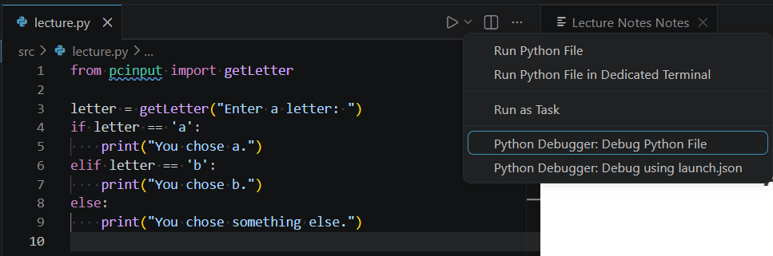
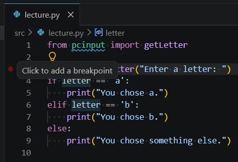
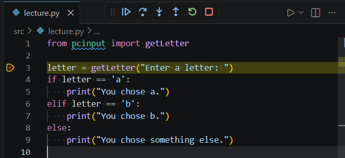
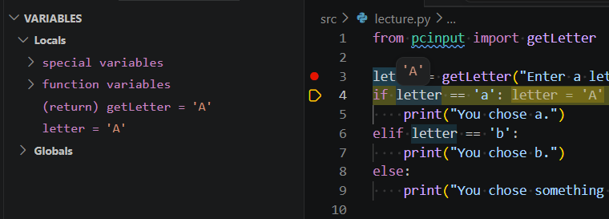

# Lecture: Match; Debugging

## Assigned Reading

- _[The Coder’s Apprentice](https://www.spronck.net/pythonbook/pythonbook.pdf)_
  - Chapter 6 - Conditions
    - 6.4 Case matching

- [Python Programming MOOC 2026](https://programming-26.mooc.fi)
  - Read the second on debugging [here](https://programming-26.mooc.fi/part-2/1-programming-terminology#debugging)

## Topics

- Case matching
- Debugging

## Case Matching

Some programming languages have a way to do multiple branches based on some condition. Python has a `match` statement. Some other languages have a `switch` statement.

Here's how it works:

- Evaluate some expression (e.g., a variable). Could be a string, integer, etc.
- Pick the correct branch of code to execute for the value of that expression.

Here is an example using Python:

```python
val = 2
match val:
    case 1:
        print("Matched 1.")
        print("Do some things.")
    case 2:
        print("Matched 2.")
        print("Do some things.")
    case _:
        print("Didn't match anything.")
        print("Do some other things.")
```

Consider this program that accepts commands as input:

```python
cmd = input("Enter a command: ")
match cmd:
    case "on":
        print("Turning on...")
    case "off":
        print("Turning off...")
    case "launch":
        print("Launching...")
```

The default case (`_`) is optional. In the above program, if an unknown command is entered, nothing happens.

We could add a default case to handle this:

```python
cmd = input("Enter a command: ")
match cmd:
    case "on":
        print("Turning on...")
    case "off":
        print("Turning off...")
    case "launch":
        print("Launching...")
    case _:
        print("Unknown command.")
```

Python supports some additional features for `case` blocks. For example, you can have multiple values match a single case. If we want the commands "launch" and "fire" to both trigger a launch, we can do this:

```python
cmd = input("Enter a command: ")
match cmd:
    case "on":
        print("Turning on...")
    case "off":
        print("Turning off...")
    case "launch" | "fire":     # <--- Added alternate condition here
        print("Launching...")
    case _:
        print("Unknown command.")
```

The textbook also shows an example of wildcards:

```python
x = 5
y = 0
match (x, y):
    case (0, 0):
        print("x and y are both 0")
    case (0, _):
        print("x is 0")
    case (_, 0):
        print("y is 0")
    case _:
        print("neither x nor y is 0")
```

In Python, the order of case statements can matter. For example, if you try to put the default case first, Python will complain:

```python
x = 5
y = 0
match (x, y):
    case _:
        print("neither x nor y is 0")
    case (0, 0):
        print("x and y are both 0")
    case (0, _):
        print("x is 0")
    case (_, 0):
        print("y is 0")
```

## Conversion to If

`match` statements (and `switch` statements in other languages) are basically fancy `if` statements.

Consider our launch program from earlier:

```python
cmd = input("Enter a command: ")
match cmd:
    case "on":
        print("Turning on...")
    case "off":
        print("Turning off...")
    case "launch" | "fire":
        print("Launching...")
    case _:
        print("Unknown command.")
```

You can convert this to an `if` statement and do the same thing:

```python
cmd = input("Enter a command: ")
if cmd == "on":
    print("Turning on...")
elif cmd == "off":
    print("Turning off...")
elif cmd == "launch" or cmd == "fire":
    print("Launching...")
else:
    print("Unknown command.")
```

## Debugging

If your program runs, but doesn't produce the right output (or crashes), then it has a [bug](https://en.wikipedia.org/wiki/Software_bug).

The process of finding and removing (fixing) bugs in a program is called _debugging_.

We mentioned types of errors in a previous lecture.

**Syntax errors** happen when your code does not match the valid structure and formatting rules of the language. The compiler or interpreter complain and prevent your program from building or running.

Try running this code:

```python
cmd = input("Enter a command: ")
if cmd == "on"
    print("Turning on...")
elif cmd == "off":
    print("Turning off...")
elif cmd == "launch" or cmd == "fire":
    print("Launching...")
else:
    print("Unknown command.")
```

The Python interpreter provides useful information about where the error is.

**Runtime errors** happen when your program encounters and exception or error while the program is running (and possibly results in a crash).

In Python, runtime errors can sometimes provide useful error messages to help locate the problem.

Try running this code:

```python
cmd = input("Enter a command: ")
if cmd == "on":
    print(f"Turning on...{int(cmd)}")
elif cmd == "off":
    print("Turning off...")
elif cmd == "launch" or cmd == "fire":
    print("Launching...")
else:
    print("Unknown command.")
```

The bug in this program happens only when the user enters the "on" command. The program starts and runs, but during execution (runtime), there is a crash under certain conditions.

In this case, Python provides a useful error message to help identify the problem.

**Logic errors** happen when your code syntax is valid, but the program does not behave as you want.

Logic errors can be harder to spot.

Consider the following program. A user reported a problem, saying they could not get the launch command to work. Do you see the bug?

```python
cmd = input("Enter a command: ")
if cmd == "on":
    print(f"Turning on...")
elif cmd == "off":
    print("Turning off...")
elif cmd == "launch" and cmd == "fire":
    print("Launching...")
else:
    print("Unknown command.")
```

Sometimes bugs are harder to track down, especially as programs grow in size and complexity.

### Print Debugging

Being able to debug code is an important skill. One technique for debugging is to use the `print()` function to output different logging messages at different points in your code. You can do this temporarily while you fix the bug, then remove them when finished (you don't want your debug messages ending up in the final product).

Consider this program:

```python
from pcinput import getLetter

letter = getLetter("Enter a letter: ")
if letter == 'a':
    print("You chose a.")
elif letter == 'b':
    print("You chose b.")
else:
    print("You chose something else.")
```

Try to run this program and enter the letter 'a'. You would think that `letter == 'a'` would be true, but it isn't. Why?

Here's where print debugging can help. Add a `print()` statement that outputs the value of `letter` after it is assigned. This way you can inspect the value of the variable to see if it contains what you think it does.

```python
from pcinput import getLetter

letter = getLetter("Enter a letter: ")
print(letter) # <-- debug print() added here
if letter == 'a':
    print("You chose a.")
elif letter == 'b':
    print("You chose b.")
else:
    print("You chose something else.")
```

Run the program again, enter 'a', and observe the output. What does the `letter` variable contain? What conclusion can you draw from this observation? How would you fix this program?

### Using a Debugger

A _debugger_ is a software program helped to assist you in debugging your own software. There are different types of debuggers with different features.

In the exercise Codespaces for this course, a Python debugger is already installed. It integrates into VS Code. It allows you to pause your program, inspect variables, and control its execution.

Debuggers are very powerful and useful tools.

First, load this program into a Python file in the exercise repository:

```python
from pcinput import getLetter

letter = getLetter("Enter a letter: ")
if letter == 'a':
    print("You chose a.")
elif letter == 'b':
    print("You chose b.")
else:
    print("You chose something else.")
```

Inside VS Code, you'll notice a "play" icon with a dropdown menu. Click **Python Debugger: Debug Python File**.



The program will run like normal. How do we take advantage of the debugger then?

This is where **breakpoints** come into play.

In the left margin of the code editor, you can hover your mouse and click the red dot to add a breakpoint on any line of code.



You can also use the F9 key on the keyboard to toggle breakpoints for the currently highlighted line of code.

Add a breakpoint on the line with the `getLetter()` function call. Then run the debugger again.

You'll notice the program will pause on that line.



Controls will appear at the top of the window. You can use these controls to step through the program line by line, resume execution, stop, or restart the program.

Use the **Step Over** button to execute the next line of code. The console input will be triggered and the program will wait for you to enter something into the console window. After that, the program will pause on the next line of code.

While the program is paused, you can hover your mouse over a variable to inspect its current value. You can also see variable values in the debugging panel on the left.



You should take time to become familiar with the debugging controls. Debugging code and fixing issues is a critical skill to have.

## Homework

None.

## Review Questions

1. Describe the three types of errors and give an example of each.

2. Practice converting a `match` statement into an `if` statement and vice versa.
