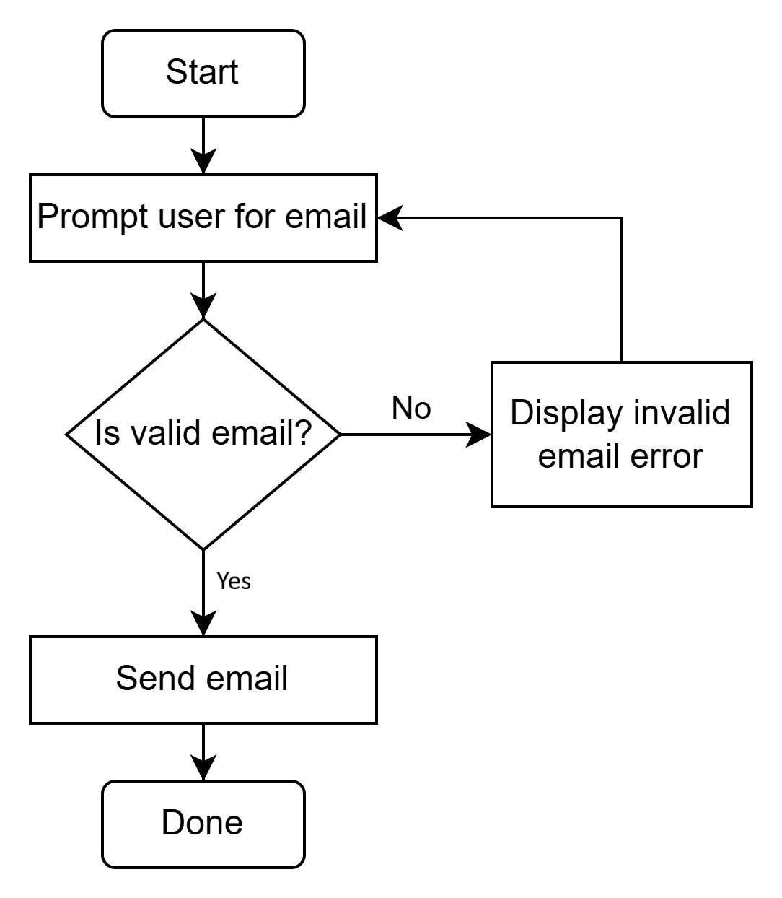
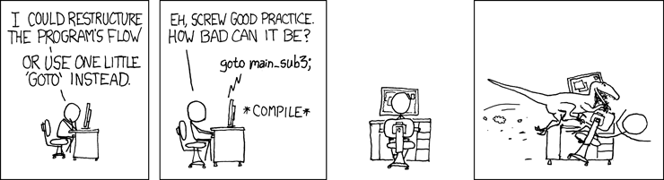

# Lecture: Loops

## Assigned Reading

- _[The Coder’s Apprentice](https://www.spronck.net/pythonbook/pythonbook.pdf)_
  - Chapter 7 - Iterations
    - 7.1 `while` loop
    - 7.3 Loop control statements
    - 7.5 The loop-and-a-half

## Topics

- While loops

## Loops

Sometimes you need to repeat certain steps of an algorithm (or certain lines of code) multiple times. You could write those lines multiple times manually. But we really want to have a built-in mechanism for repetition.

Consider a program that prompts a user to enter an email address. The program must keep prompting the user to enter an email until they enter a valid one.

In flow charts, this is easily illustrated:


<br/>

Programming languages have ways of implementing these loops.

Perhaps the most fundamental version of this is the `goto` or `jump` commands. We used this approach in our pseudocode earlier in the semester:

```
1. Prompt user for email.
2. Check if email is valid.
3. If email is not valid:
4.     Goto line 1.
5. Send email.
```

This is actually how a computer processor works. Some programming languages support instructions like this.

However, Python does not. In fact, most programmers frown on using such statements to implement loops in high-level programming languages except in certain circumstances. These "goto" statements can lead to so-called "spaghetti code" - code that jumps around to various places and is hard to read, increasing the potential for bugs.

There is a famous writing from computer scientist Edsger Dijkstra called "Go To Statement Considered Harmful" (you can read it [here](https://homepages.cwi.nl/~storm/teaching/reader/Dijkstra68.pdf)). He argued against using these types of statements all over the place and instead advocated for "structured programming." Naturally not everyone agreed.

By now it is very rare to see code with a "goto" statement.


<br/>

In Python, you can't use "goto" even if you wanted to. The language doesn't support it.

So what is the alternative that programming languages use? Loops!

## While Loops

The `while` loop will repeat a block of code as long as some condition is true.

```python
i = 0

print("Start of loop.")

while i < 5:
    print(f"i is {i}.")
    i += 1

print("End of loop.")
```

- Python evaluates the condition after the `while` (in this case, is `i < 5`?).
- If `True`, the code nested underneath the `while` loop gets executed.
- After executing the code block, Python re-evaluates the condition (is `i < 5`?).
- If `False`, the program jumps to the line after the nested while loop block and continues on.
- (Remember, in Python nested code blocks are defined by indentation.)

Here is a program that implements the pseudocode listed earlier (checking for a valid email address):

```python
import re

email_regex = r"(^[a-zA-Z0-9_.+-]+@[a-zA-Z0-9-]+\.[a-zA-Z0-9-.]+$)"
email = ""
valid = False

while not valid:
    email = input("Enter your email address: ")
    if re.match(email_regex, email):
        valid = True
    else:
        print("Invalid email address. Please try again.")

print(f"Thank you! Your email '{email}' has been accepted.")
```

- Side note: "regex" means "regular expression" - not a topic for this lecture, but you can look them up if you are interested. It lets you do complex pattern matching.

You can use whatever Boolean expression you want as the "test" for the `while` loop.

_How many times will the loop below execute?_

```python
x = 0
y = 5

while x < 15 and y > 0:
    print(f"{x} and {y}")
    x += 2
    y -= 1
```

## Infinite Loops

It's possible for a `while` loop to never end. This is an _infinite loop_.

Here is an obvious example:

```python
while True:
    print("This won't end...")
```

Here is a less obvious example:

```python
x = 0
while x % 2 == 0:
    print("Not again...")
    x += 2
```

If you run a program that gets stuck in a loop, click into your terminal window that is running the program (to give it focus) and then press `Ctrl+C` a couple times. This will force the program to terminate.

## Branches inside Loops

You can put `if...else` inside a loop. (In fact, you can put most anything inside a loop.)

```python
total = 0
while total < 100:
    print(f"Total is {total}.")

    if total % 2 == 0:
        total += 7
    else:
        total += 3
```

Just make sure your indentations are correct! The code below looks the same, but it is not!

```python
total = 0
while total < 100:
    print(f"Total is {total}.")

if total % 2 == 0:
    total += 7
else:
    total += 3
```

## Exercise

Do the "Simple Loop" exercise.

You can do this exercise with a partner. You must both submit a solution, but you can come up with the solution together.

## `break`

If you want to jump out and end a loop before the loop test fails, you can use a `break` statement inside the loop body.

```python
while True:
    pw = input("Enter the password: ")
    if pw == 'kronos':
        break

    print("Invalid password.")

print(f"Welcome!")
```

- Notice the use of `while True:`. This is a valid approach to solving certain problems.

## `continue`

If you want to skip over the remaining part of the current iteration of a loop, but don't want to completely exit the loop outright, use the `continue` statement.

```python
num = 50
while num > 0:
    num -= 1
    if num % 10 == 0:
        continue

    print(num)
```

- Try replacing the `continue` in the code above with `break` and observe the different behaviors.

## Iteration Errors

There's a famous joke (if I haven't made it yet, here it is again):

> There are two hard things in computer science:
>
> 1. naming things
> 2. cache invalidation
> 3. off-by-one errors

When you are setting up a loop to iterate over a sequence of numbers, pay close attention to your loop test.

Let's say you want to print numbers from 0 to 10. You want to _include_ both 0 _and_ 10. Does the following code do what you want?

```python
num = 0
while num < 10:
    print(num)
    num += 1
```

Let's say you want to print numbers from 10 to 0. You want to _exclude_ both 0 _and_ 10. Does the following code do what you want?

```python
num = 11
while num > 0:
    print(num)
    num -= 1
```

You must consider both the starting value of the counter variable (whatever you are using for the loop test) _and_ the loop test itself (`<`, `>`, `<=`, or `>=`).

## Exercise

Do the "Apollo Countdown" exercise.

You can do this exercise with a partner. You must both submit a solution, but you can come up with the solution together.

## The loop-and-a-half

Look at the example in the textbook in section 7.5 about the "loop-and-a-half". If we don't have time to cover it in class, you should read this on your own.

Here is `listing0712.py` from the text:

```python
from pcinput import getInteger

x = 3
y = 7

while (x != 0) and (y != 0) and (x % y != 0) and (y % x != 0):
    x = getInteger("Enter number 1: ")
    y = getInteger("Enter number 2: ")
    if (x > 1000) or (y > 1000) or (x < 0) or (y < 0):
        print("Numbers should both be between 0 and 1000")
        continue
    print("Multiplication of", x, "and", y, "gives", x * y)

if x == 0 or y == 0:
    print("Goodbye!")
else:
    print("Error: the numbers cannot be dividers")
```

Here is `listing0713.py`:

```python
from pcinput import getInteger

x = getInteger("Enter number 1: ")
y = getInteger("Enter number 2: ")

while (x != 0) and (y != 0) and (x % y != 0) and (y % x != 0):
    if (x > 1000) or (y > 1000) or (x < 0) or (y < 0):
        print("Numbers should both be between 0 and 1000")
        x = getInteger("Enter number 1: ")
        y = getInteger("Enter number 2: ")
        continue

    print("Multiplication of", x, "and", y, "gives", x * y)
    x = getInteger("Enter number 1: ")
    y = getInteger("Enter number 2: ")

if x == 0 or y == 0:
    print("Goodbye!")
else:
    print("Error: the numbers cannot be dividers")
```

Here is `listing0714.py`:

```python
from pcinput import getInteger
from sys import exit

while True:
    x = getInteger("Enter number 1: ")
    if x == 0:
        break

    y = getInteger("Enter number 2: ")
    if y == 0:
        break

    if (x < 0 or x > 1000) or (y < 0 or y > 1000):
        print("The numbers should be between 0 and 1000")
        continue

    if x % y == 0 or y % x == 0:
        print("Error: the numbers cannot be dividers")
        exit()

    print("Multiplication of", x, "and", y, "gives", x * y)

print("Goodbye!")
```
