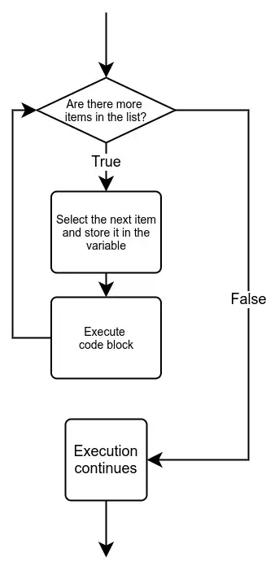

# Lecture: Loops

## Assigned Reading

- _[The Coder’s Apprentice](https://www.spronck.net/pythonbook/pythonbook.pdf)_
  - Chapter 7 - Iterations
    - 7.2 `for` loop
    - 7.3 Loop control statements
    - 7.4 Nested loops

## Topics

- For loops

## `for`

A `for` loop is an alternate way of creating loops in Python. It iterates over items in a collection.

The basic syntax is:

```python
for <variable> in <collection>:
    <statements>
```

Here is a flowchart that illustrates how a `for` loop works:



_Image credit: [mooc.fi](https://programming-26.mooc.fi/part-4/4-definite-iteration)_

### Range

Here is an example of iterating over a collection of numbers:

```python
for i in range(0, 10):
    print(i)
```

The `range()` function is built into Python to generate a collection of numbers.

- The first number is the starting number.
- The second number is the cutoff number (the ranges goes up to this number, but does not include it).

Examples:

- `range(0, 10)` generates the collection `(0, 1, 2, 3, 4, 5, 6, 7, 8, 9)`.
- `range(0, 2)` generates the collection `(0, 1)`
- `range(0, 1)` generates the collection `(0)`

If you want to iterate over the numbers 10 through 20 (_including 20!_), then you could do:

```python
for i in range(10, 21):
    print(i)
```

Notice how the variable `i` is used to reference the current item being used in the collection. You can name this variable whatever you want. For example:

```python
for num in range(10, 21):
    print(num)
```

### Strings

A string is a collection of characters. Therefore, you can use a `for` loop to iterate over each character in a string one-by-one.

```python
name = "Alice"
for char in name:
    print(char)
```

### Tuples

You can define a manual collection of items to iterate over.

```python
for num in (10, 15, 19, 23):
    print(x)
```

The set of parentheses with values is called a _tuple_ in Python.

```python
for name in ("Bob", "Alice", "Greg"):
    print(name)
```

## Exercise

Do the "Simple for Loop" exercise.

You can do this exercise with a partner. You must both submit a solution, but you can come up with the solution together.

## `break` and `continue`

The control flow statements `break` and `continue` can be used in `for` loops just like we saw in `while` loops.

What does this code do?

```python
for num in range(0, 10):
    if num % 2 == 1:
        continue

    print(num)
```

What is the difference between the previous code and the following code?

```python
for num in range(0, 10):
    if num % 2 == 1:
        break

    print(num)
```

## Nested Loops

You can put loops inside of loops (loop inception!)!

```python
for i in range(0, 3):
    for j in range(0, 5):
        print(f"{i}, {j}")
```

A common example might be looping over a 2D structure like a grid or matrix.

```python
for row in range(0, 5):
    # end='' prevents adding a newline at the end
    print(f"Row {row}: ", end='')

    for col in range(0, 10):
        print(f"{col} ", end='')

    print()  # Add the end-line for this row
```

- The inner `for` loop is part of the loop body (code block) for the outer `for` loop.

You could use a combination of `while` and `for` loops.

```python
from pcinput import getInteger

while True:
    num = getInteger("Enter a number, or 0 to exit: ")
    if num == 0:
        break

    for i in range(0, num):
        print(i)
```

## Exercise

Do the "From Negative to Positive" exercise.

You can do this exercise with a partner. You must both submit a solution, but you can come up with the solution together.

## Homework

Complete the remaining exercises for this lecture. You must do these on your own.

**Commit and push to GitHub.**

Ensure the automated tests pass.

## Review Questions

Some `while` loops are also thrown in here for good measure.

1.  What is the value of `x` after the following code executes?

    ```python
    x = 2
    while x < 5:
        x += 1
    ```

1.  What is the value of `x` after the following code executes?

    ```python
    x = 5
    for i in range(0, 4):
        x += i
    ```

1.  What is the value of `x` after the following code executes?

    ```python
    x = 5
    for i in range(0, 5):
        x -= i
    ```

1.  What is output by the following code?

    ```python
    for i in range(0, 3):
        print(i + 1, end='')
        print(" ", end='')
    print("done")
    ```

1.  What is output by the following code?

    ```python
    x = 10
    y = 50
    while (y - x) % 3 != 0:
        print(y)
        y = y - 5
    ```

1.  What is output by the following code?

    ```python
    for i in range(0, 10):
        print(i)
        break
    ```
