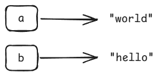
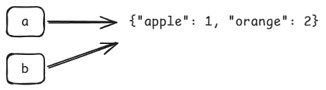
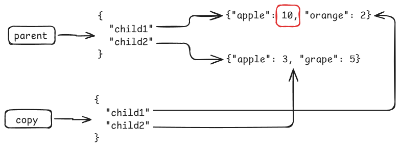
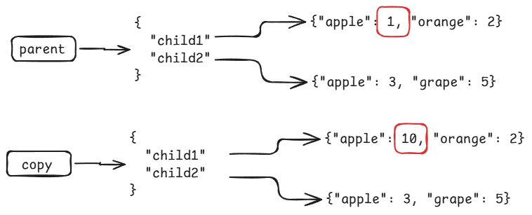

# Lecture: Dictionaries

## Assigned Reading

- _[The Coder’s Apprentice](https://www.spronck.net/pythonbook/pythonbook.pdf)_
  - Chapter 12 - Lists
    - 12.5 Aliasing
  - Chapter 13 - Dictionaries
    - 13.1 Basics of dictionaries
    - 13.2 Dictionary methods
    - 13.3 Keys
    - 13.4 Storing complicated values
    - 13.5 Lookup speed

## Topics

- Dictionaries
- Aliasing; shallow vs deep copies
- Comparing lists vs dictionaries

## Dictionaries

A dictionary is another type of data structure.

A real-life dictionary is a collection of words matched to definitions. If you know a word, you can look up the definition.

A Python dictionary is a collection of "keys" matched to "values". If you know the key, you can look up the value. You may hear these called "key-value pairs".

A key can be any value, though it is common for strings to be used as keys. Values can be any value.

### Creating a Dictionary

Create a dictionary in Python using `{}`.

```python
d = {} # Empty dictionary
print(d)
```

To define key-value pairs inside the dictionary:

```python
d = { "key": "value" }
```

Here are some examples:

```python
d = {
    "name": "Bob",
    "number": 12,
    "scores": [1, 3, 4, 7],
    125: "some value"
}
```

### Lookup

Use square brackets to lookup a value in a dictionary.

```python
print(d["name"])
print(d["scores"])
print(d[125])
```

You can also use the `get()` method.

```python
print(d.get("name"))
print(d.get("scores"))
print(d.get(125))
```

What happens if you try to access a key that does not exist in the dictionary?

```python
print(d.get("not a key"))
print(d.get(0))

print(d["not a key"])
print(d[0])
```

- Note the different behaviors of `[]` and `get()`.

You can also check to see if a key is present in the dictionary:

```python
if "name" in d:
    print("Found it")
```

### Data Types

Although you _can_ combine different value data types in the same dictionary, most often you will see a dictionary be consistent. For example, a single dictionary might contain all string keys and all integer values, or all string keys and all string values, etc. In fact, many languages enforce such a pattern.

### Modification

You can add and remove key-value pairs from a dictionary.

Consider this dictionary:

```python
# How many of each fruit we have
fruit = {
    "apple": 1,
    "orange": 1
}
```

To add a new key:

```python
fruit["grape"] = 3
```

To update an existing key:

```python
fruit["apple"] = 10
```

To remove a key, use the `del` keyword:

```python
del fruit["apple"]
```

### Iteration

You can iterate over the keys in a dictionary:

```python
for key in fruit:
    print(f"{key}: {fruit[key]}")
```

If you want to access a list of only the keys in the dictionary:

```python
print(fruit.keys())
```

If you want to access a list of only the values in the dictionary:

```python
print(fruit.values())
```

## Exercise

Do the "Character Counts" exercise.

You can do this exercise with a partner. You must both submit a solution, but you can come up with the solution together.

## Lists vs Dictionaries

_What is the difference between a list and a dictionary, and why might you choose one over the other?_

- Ordered vs keyed
- Lookup speed?

## Aliasing

You should be familiar with variables at this point.

```python
some_variable = 100
```

You can copy a value from one variable to another.

```python
a = "hello"
b = a

print(a, b)
```

This hasn't been a problem up to this point.

What will be output by this code?

```python
a = "hello"
b = a
a = "world"
print(a, b)
```

For simple data types like this, assigning one variable to another will create a copy of the value and store it in the other variable.



Lists and dictionaries are a different story.

Consider this code:

```python
a = {"apple": 1, "orange": 2}
b = a

print(a)
print(b)
```

- This behaves like expected.

What happens when you try to modify the other dictionary? What do you expect to see output by the following code?

```python
a = {"apple": 1, "orange": 2}
b = a

b["apple"] = 5    # Change the number of apples

print(a)
print(b)
```

When you try to copy a list or dictionary to another variable, Python does not actually create a new object. Instead, the variable acts like an _alias_ (in C terms, a _pointer_). The new variable references the same dictionary as the source variable.



A cool visualization tool for Python can be found here:

- https://pythontutor.com/visualize.html#mode=edit

_Why do you think Python does this? What advantages are there?_

Consider a function that accepts a dictionary as input:

```python
def missing_keys(a, b):
    """
    Find keys in dictionary b that are not present in dictionary a.
    """
    missing = []
    for key in b:
        if key not in a:
            missing.append(key)

    return missing

a = {'a': 1, 'b': 2}
b = {'a': 2, 'c': 3}
print(missing_keys(a, b))
```

- A dictionary may contain a lot of data.
- Creating a full copy of the dictionary takes time and memory.
- It's faster to reference (alias) the original dictionary instead of creating a copy.

What if you really do want a new copy of the dictionary?

For dictionaries, Python supports a `.copy()` method:

```python
a = {"apple": 1, "orange": 2}
b = a.copy()      # Create a copy this time

b["apple"] = 5    # Change the number of apples

print(a)
print(b)
```

### Shallow vs Deep Copy

We will talk about this more later in the semester, but it's worth introducing here.

What happens if you start storing complex objects nested inside a complex object (e.g., a dictionary inside a dictionary)?

```python
parent = {
    "child1": {"apple": 1, "orange": 2},
    "child2": {"apple": 3, "grape": 5}
}
```

- The value of the key `child1` is a dictionary.
- The value of the key `child2` is a dictionary.

What happens if you try and create a copy of `parent`?

```python
copy = parent.copy()
copy["child1"]["apple"] = 10

print("Parent: ", parent)
print("Copy:", copy)
```

Even though we created a copy of `parent`, the child dictionaries are still aliases!

This is called a **shallow copy**. It didn't drill down and create copies of all the nested objects.



If you want to have copies of all nested objects (so your new variable is completely independent of the source), you need to use a **deep copy**.

Python has a special function for doing a deep copy.

```python
from copy import deepcopy    # Import deepcopy()

parent = {
    "child1": {"apple": 1, "orange": 2},
    "child2": {"apple": 3, "grape": 5}
}

copy = deepcopy(parent)    # Use deepcopy() to do the copy
copy["child1"]["apple"] = 10

print("Parent: ", parent)
print("Copy:", copy)
```



## Homework

Complete the remaining exercises for this lecture. You must do these on your own.

**Commit and push to GitHub.**

Ensure the automated tests pass.

## Review Questions

1. What is output by the following code?

   ```python
   d = {"red": "stop", "green": "go"}
   print(d["red"])
   ```

1. What happens when the following code executes? (Look carefully)

   ```python
   d = {"red": "stop", "green": "go"}
   print(d["yellow"])
   ```

1. What is output by the following code?

   ```python
   d = {"red": "stop", "green": "go"}
   d["yellow"] = "warning"
   print(d["yellow"])
   ```

1. What is output by the following code?

   ```python
   d = {"Bob": [99, 100, 101], "Alice": [50, 51, 52]}
   print(d["Bob"][1])
   ```

1. What is output by the following code?

   ```python
   d = {"Bob": [99, 100, 101], "Alice": [50, 51, 52]}
   print(d["Alice"][2])
   ```

1. What is output by the following code?

   ```python
   d = {"Bob": [99, 100, 101], "Alice": [50, 51, 52]}
   x = d.copy()
   x["Bob"][0] = 15
   print(d["Bob"][0])
   ```

1. What is output by the following code?

   ```python
   from copy import deepcopy

   d = {"Bob": [99, 100, 101], "Alice": [50, 51, 52]}
   x = deepcopy(d)
   x["Bob"][0] = 15
   print(d["Bob"][0])
   ```

1. What is output by the following code?

   ```python
   fruit = {"apple": 10, "banana": 5, "grape": 8}
   fruit["orange"] = 2

   for f in fruit:
       print(f"{f}: {fruit[f]}")
   ```

1. What is output by the following code?

   ```python
   fruit = {"apple": 10, "banana": 5, "grape": 8}
   fruit["orange"] = 2

   for f in fruit.values():
       print(f"{f}")
   ```
