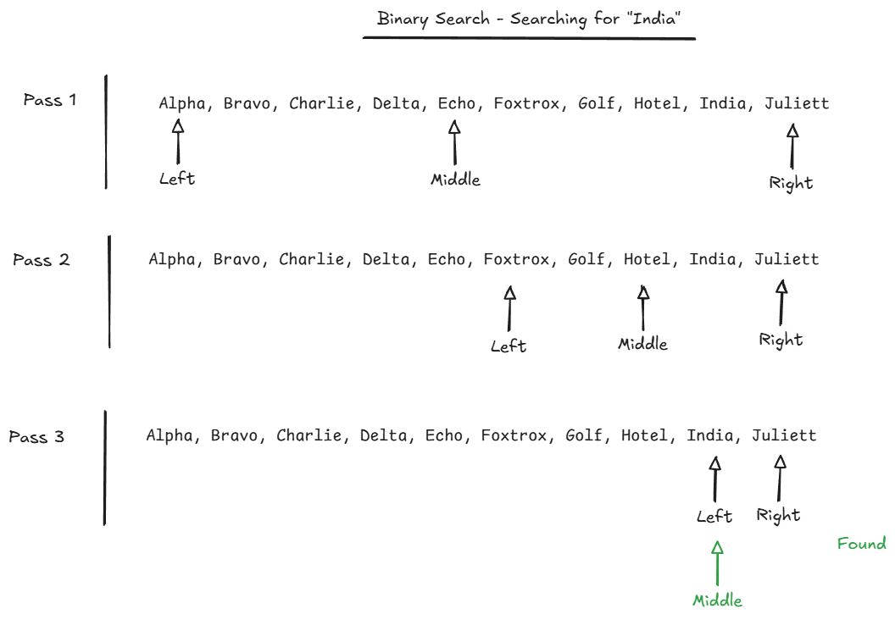
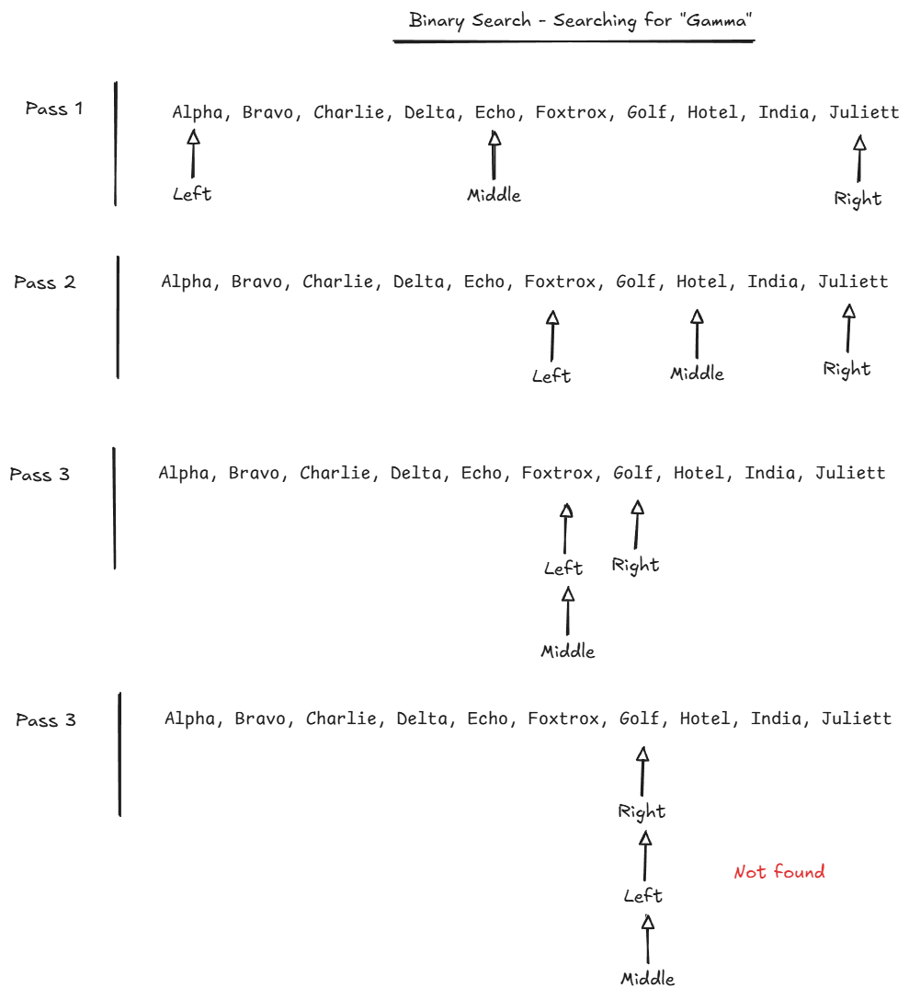

# Binary Search

Review the search algorithm we discussed at the beginning of the semester.

```
1   Pick up dictionary
2   Open to middle of book
3   Look at page
4   If word is on page
5       Read definition
6   Else if word is earlier in book
7       Open to middle of left half of book
8       Go back to line 3
9   Else if word is later in book
10      Open to middle of right half of book
11      Go back to line 3
12  Else
13      Quit
```

This is called a binary search. Today you will implement this algorithm in Python.

## Algorithm

We need to make this algorithm a little more generic for today's exercise.

You are going to do a binary search on a Python list. The list will be a list of strings and will be sorted alphabetically.

```
1  Identify the left and right indices of list (0, len(list) - 1)
2  If left index > right index
3      Done - not found

4  Identify middle index (between left and right)
5  word = item at middle index

6  If word == target
7      Done - found
8  Else if word comes before target
9      Right index = middle index - 1
10     Goto line 2
11 Else
12     Left index = middle index + 1
13     Goto line 2
```





## Exercise

Do the "Binary Search" exercise.

You can do this exercise with a partner. You must both submit a solution, but you can come up with the solution together.
