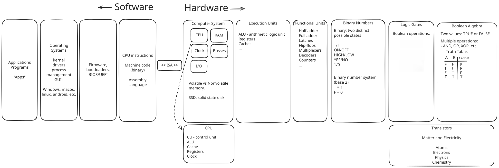
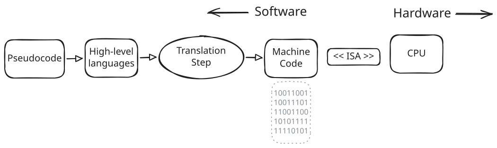
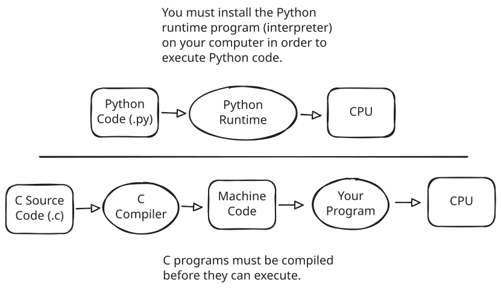

# Computer Architecture

[Slides](https://docs.google.com/presentation/d/1qgJEEDm_y9ZrwyZe8BP3jyqWuRuvro4dZaGFbM56lCI/edit?usp=sharing)

## Highlights

- A digital computer fundamentally operates using Boolean logic, 0s and 1s, electronic circuits, and transistors.

- Everything you do on a computer must be represented as a discrete number. This means all instructions sent to the CPU and all data that is processed must be encoded as a (binary) number.

- Concept of abstraction is everywhere in computer science!

- Main components of a CPU:
  - CU (control unit) - coordinates CPU operations; decodes instructions and schedules them for execution.
  - ALU (arithmetic logic unit) - executions mathematical and logical calculations.
  - Registers - stores pieces of data being used by instructions that are being executed. Volatile.
  - Cache - storage area inside CPU used for quick access to repeatedly used data. Not controlled by programmers. Volatile.

- Main components of a computer system:
  - CPU - brain of the computer. Executes instructions.
  - RAM - main memory location. All programs and data must be loaded into RAM before the CPU can use it. Volatile.
  - I/O - input and output devices (audio, video, keyboards, mice, controllers, etc.).
  - storage (e.g., SSD, HDD, removable storage) - **non-volatile** storage location for operating system, applications, and data.
  - clock - synchronizes and determines rate of instruction execution.
  - bus - hooks different components together and allows them to communicate.

- Volatile vs non-volatile memory:
  - Volatile memory must be powered at all times; stored data is lost when device is powered off.
  - Non-volatile memory retains data even when not powered.

## Translation Pipeline

- Machine code: CPU instructions encoded into binary.
- Assembly code: a more human-readable version of machine code.
  - Examples: x86, ARM, RISC-V
- High-level code: provides statements closer to human language and logic, along with various features and abstractions.
  - Examples: C, C++, C#, Python, Java, Rust

A translation step is required to high-level code and convert it into machine code.

Usually this is done by a program called a _compiler_. For example, a C program has source code written using the C programming language. Developers must install a C compiler program on their computer to convert C source code into an executable program containing machine code. The executable file can be given to end-users who can then run the program on their computer.

Some programming languages use a different approach. Some languages require a runtime program to be installed in order to interpret and execute programs. Python source code is stored in a text file and distributed to end-users this way. End-users must install the Python runtime (interpreter) on their computer in order to execute the Python code.

## Additional Notes

_Additional notes on language translation are provided below for those interested._

We have greatly simplified the translation process of high-level source code into machine code. This is necessary because the process is fairly complex and there are different approaches and techniques used by different languages.

Here are three approaches to the translation process:

- _Ahead-of-time_ (AOT) compilation: source code is translated into machine code of the target CPU before the program is executed (it's compiled "ahead of time", hence the name). If using a language like C or C++, you are most likely using AOT compilation.

- _Interpretation_: source code is read by a runtime program, which knows how to parse and execute the statements of the source code.

- _Just-in-time_ (JIT) compilation: source code is converted into a virtual machine language (usually called _bytecode_). The bytecode instructions are converted by the runtime program into native machine code whenever the user runs the program (it happens "just in time"). The conversion from source code to bytecode can happen ahead-of-time or just-in-time.

You may hear discussions on "compiled vs interpreted languages". In reality, things don't fall into such clear-cut boundaries. A language itself is not necessarily tied to how it is translated into machine code.

For example, you can get alternate implementations of the Python runtime to execute your Python programs.

- [CPython](https://github.com/python/cpython) is the default runtime you get if you install Python from [python.org](https://www.python.org/downloads/). This is the "reference implementation".
- [PyPy](https://pypy.org/) is an alternate runtime that uses JIT compilation.
- [IronPython](https://ironpython.net/) is a version of Python that uses the .NET runtime.
- [Jython](https://www.jython.org/) is a version of Python that uses the Java runtime (JVM).
- See [here](https://www.python.org/download/alternatives/) for more examples.
