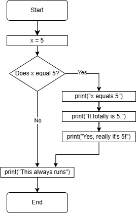
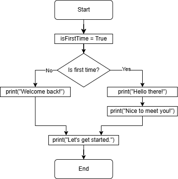

# Lecture: If

## Topics

- Boolean expressions
- If statements

## Boolean

Python supports a Boolean data type. It can be either `True` or `False`.

**C has no Boolean data type.**

- Any non-zero value is considered to be true.
- A zero value is considered to be false.

Some C programs use an `int` to represent a Boolean value.

```c
int is_on = 1;
int is_active = 0;
```

Some C programs define macros and type aliases to simulate Boolean types:

```c
#define TRUE 1
#define FALSE 0
typedef int bool;

// ...

bool is_on = TRUE;
bool is_active = FALSE;
```

## Comparisons

C supports most of the same comparisons that Python does. Remember that these comparisons come in handy when doing decision making in an algorithm.

This is a frequent task when asking those yes/no questions used in decision making.

- Did the user enter a number less than 10?
- Is the variable `count` greater than or equal to 50?
- Is the user's name equal to "Alice"?
- Is the user's name _not_ equal to "Alice"?
- Is there time left on the clock?
- etc.

Here are some comparison operators:

```
==  equal to
!=  not equal
<   less than
<=  less than or equal to
>=  greater than or equal to
>   greater than
```

These operators will let you compare numbers and individual characters.

```c
printf("1. %d\n", 2 < 5);
printf("2. %d\n", 2 <= 5);
printf("3. %d\n", 3 > 3);
printf("4. %d\n", 3 >= 3);
printf("5. %d\n", 3 == 3.0);
printf("6. %d\n", 3 == '3');
printf("7. %d\n", 'a' == 'a');
printf("8. %d\n", 'a' == 'b');
printf("9. %d\n", 'a' != 'b');
printf("10. %d\n", 'a' > 'b');
printf("11. %d\n", 'a' < 'b');
```

In C, comparing strings does not work like you'd expect. We'll talk more about this later.

Variables can be used in comparisons:

```c
int a = 2;
int b = 5;
printf("%d\n", a > b);
printf("%d\n", a < b);
printf("%d\n", a == b);
printf("%d\n", a != b);
```

## If Statements

Conditional statements are used to control the flow of a program by evaluating the result of some Boolean expression. You should be familiar with `if` statements from Python.

They behave basically the same in C, with minor syntax changes.

```c
int x = 5;
if (x == 5) {
    printf("x equals 5\n");
}

printf("This always runs\n");
```

- Notice the parentheses around the test expression. These are required.
- Notice the curly braces around the conditional block. Any code you want to execute if the test expression is true must be inside the curly braces.
- Indentation is not _required_ by C code (you can put everything on one line). However, it is highly recommended to keep things nice and correctly indented to make the code easy to read.

Multiple lines of code inside the `if` branch:

```c
int x = 5;
if (x == 5) {
    printf("x equals 5\n");
    printf("It totally is 5.\n");
    printf("Yes, really it's 5!\n");
}

printf("This always runs\n");
```

Here's the same flowchart we showed back when discussing `if` statements in Python:



## Two-way Branches

Sometimes you need two separate branches based on a condition:

```c
int is_first_time = 1;
if (is_first_time) {
    printf("Hell there!\n");
    printf("Nice to meet you!\n");
}
else {
    printf("Welcome back!\n");
}
```

- Notice the evaluation of the integer value as a Boolean expression. Try changing `is_first_time` to different values and observe the behavior.

Here is a flow chart to help illustrate the behavior of this program:



Pay close attention to which branches of code are executed when the Boolean expression is True and when it is False.

## Multiple Branches

You may need to ask a sequence of questions to determine which branch to take. If the first question is a "no", you proceed to ask the next question.

Here is an example in C:

```c
int age = 21;
if (age < 12) {
    printf("You're still a child!\n");
}
else if (age < 18) {
    printf("You are a teenager!\n");
}
else if (age < 30) {
    printf("You're pretty young!\n");
}
else if (age < 50) {
    printf("Wisening up, are we?\n");
}
else {
    printf("Aren't the years weighing heavy?\n");
}
```

- Notice that C uses `else if` instead of `elif` like Python.

What is the difference between the previous code and the following code?

```c
int age = 21;
if (age < 12) {
    printf("You're still a child!\n");
}
if (age < 18) {
    printf("You are a teenager!\n");
}
if (age < 30) {
    printf("You're pretty young!\n");
}
if (age < 50) {
    printf("Wisening up, are we?\n");
}
else {
    printf("Aren't the years weighing heavy?\n");
}
```

When writing code, you want to choose the correct combination of `if`/`else if`/`else` branches that correctly implement the logic needed for your algorithms.

A few other notes (these are the same rules as Python):

- An `else` branch **cannot** exist by itself.
  - It must be attached to an `if` branch or and `else if` branch.
  - It must be the last branch in the chain.
  - There can only be one `else` branch attach to an `if`.
- An `else if` branch **cannot** exit by itself.
  - It must come after an `if` or another `else if`.

## Logical Operators

You can use logical operators in C to combine multiple Boolean expressions using Boolean logic.

```
&&    Boolean AND
||    Boolean OR
!     Boolean NOT
```

Here are some examples:

```c
int x = 5;
int y = 6;

if (x == 5 && y == 5) {
    printf("Both are 5.\n");
}
else if (x == 5 || y == 5) {
    printf("At least one is 6.\n");
}
else {
    printf("Neither is 5.\n");
}
```

The logical not operator flips the Boolean value.

```c
int x = 5;
int y = 6;

if (!(x > 10)) {
    printf("x is not greater than 5.\n");
}

if (!(y == 6)) {
    printf("x is not greater than 6.\n");
}
```

## Exercise

Do the "Odd or Even" exercise.

You can do this exercise with a partner. You must both submit a solution, but you can come up with the solution together.

## Homework

Complete the remaining exercises for this lecture. You must do these on your own.

**Commit and push to GitHub.**

Ensure the automated tests pass.

## Review Questions

1. What is the final value of `y` after this code executes?

   ```c
   int x = 15;
   int y = 20;

   if (x == 15) {
       y = 10;
   }
   ```

1. What is the final value of `y` after this code executes?

   ```c
   int x = 5;
   int y = 5;

   if (x == 15) {
       y = 10;
   }
   ```

1. What is the final value of `y` after this code executes?

   ```c
   int x = 5;
   int y = 5;

   if (x == 15) {
       y = 10;
   }
   else {
       y = 20;
   }
   ```

1. What is the final value of `y` after this code executes?

   ```c
   int x = 10;
   int y = 20;

   if (x == 15) {
       y = 10;
   }
   if (x < 20) {
       y = 25;
   }
   else if (y == 20) {
       y = 30;
   }
   if (y == 25) {
       y = y + x;
   }
   ```
