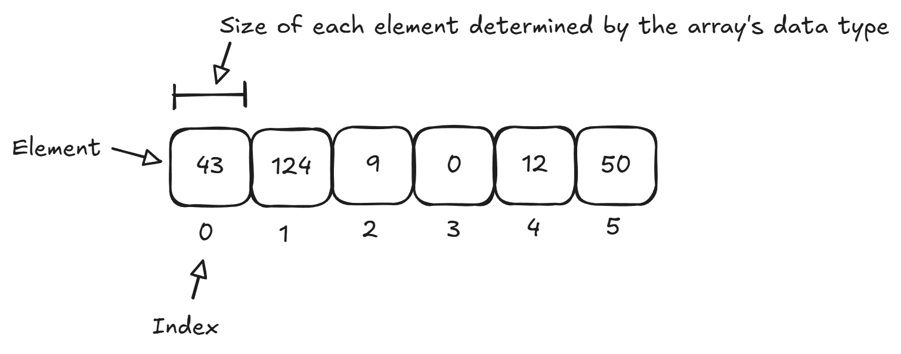
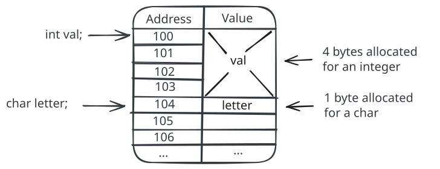
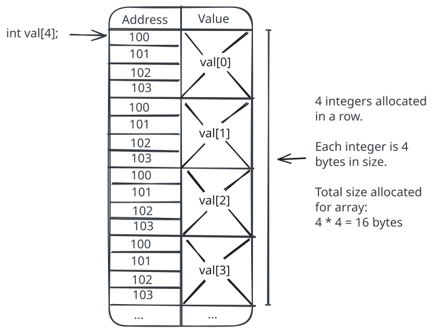

# Lecture: Arrays

## Topics

- Arrays in C
- Array initialization
- Array iteration

## Arrays in C

In Python, we saw how to use a list data structure. It was an ordered collection of items. We could access items by their index.

C does not have a list data structure. Instead, it has arrays. You can think of an array has a very rudimentary form of a list, without the extra features. In fact, you can create a list data structure _using_ an array (take CPSC 211 if you want to do that!).

Example of declaring an array in C:

```c
int year;      // Regular integer variable (scalar value)
int years[4];  // Array variable of 4 integers (array value)
```

### Basics

A single variable stores a single value. Memory is allocated for that variable depending on its data type.

An array is a series of multiple items in a row.



- Each item in the array is called an _element_.
- Each element holds a single value.
- Each element can be accessed by its _index_. This is an offset from the beginning of the array. The first element is at index 0, the second at index 1, and so on.
- Every element in the array has the same data type.
- The size of each element is determined by the data type of the array. For example, in an array of `int`, all elements are integers and take up 4 bytes per element.
- The number of elements (length of the array) is specified when the array variable is declared.

### Memory

Memory is a big table of bytes. Each byte in memory is assigned an address. A compiler has to allocate (reserve) the correct number of bytes for each variable you create.

```c
int val;       // A single integer variable
char letter;   // A single character variable
```



These variables have a single value.

An array allocates memory for _multiple_ values, each right beside each other in memory.

```c
int val[4];   // An array of 4 integers
```

- You put the number of items to want to allocate inside the square brackets `[]`.



- Each item (element) in the array is stored in memory one right after another (no gaps). The items are _contiguous_ in memory.
- The size of each element is determine by the array variable's data type. In this example, an `int` is used, so each element uses four bytes.
- Total memory allocated for an array will be: `elementSize * numElements`

### Usage

Let's look at using arrays.

```cpp
int year;      // Regular integer variable (scalar value)
int years[4];  // Array of integers variable (array value)
```

Value assignment with a regular variable:

```c
year = 2026;   // Assignment to a regular variable
```

Value assignments with an array must specify the index of the item to update:

```c
/*
Elements: ___  ___  ___  ___
Index:     0    1    2    3
*/

years[0] = 2024; // Assignment to index 0
years[1] = 2020; // ...
years[2] = 2016;
years[3] = 2012;
years[4] = 2008; // This is invalid - this can potentially do bad things!
```

- Accessing an index outside the bounds of the array should be avoided. It will cause the CPU to try and read from that slot in memory, which could either be data from another variable, or data not owned by your program (which will cause the operating system to kill your program).

Example of reading values:

```c
printf("%d\n", year);      // Regular read
printf("%d\n", years[0]);  // Read at index 0
printf("%d\n", years[1]);  // Read at index 1
printf("%d\n", years[2]);  // Read at index 2
printf("%d\n", years[3]);  // Read at index 3
```

You can use literal values when specifying an index, but you can also use expressions.

```c
int index = 2;
printf("%d\n", years[index]);
printf("%d\n", years[index - 1]);
```

### Initial Values

You can set some initial values for an array using curly braces.

```c
int years[4] = { 2024, 2028, 2032, 2036 };
printf("%d\n", years[0]);
```

You can omit the number of elements if doing this:

```c
int years[] = { 2024, 2028, 2032, 2036 };
printf("%d\n", years[0]);
```

You cannot use this syntax to assign values after the array has already been created.

```c
int years[4];
years = { 2024, 2028, 2032, 2036 }; // Syntax error
```

## Exercise

Do the "Arrays Intro" exercise.

You can do this exercise with a partner. You must both submit a solution, but you can come up with the solution together.

## Iteration

It is very common to write code that iterates (loops) through all items in an array. A `for` loop is perfect for this.

```c
int years[4] = { 2024, 2028, 2032, 2036 };

for (int i = 0; i < 4; i++) {
    printf("%d\n", years[i]);
}
```

**You should practice writing loops to iterate through arrays.** This should become second nature to you. You should be able to write an array iteration loop without thinking about it.

- Try to trace the a loop execution using pencil and paper if you are having trouble. Write the values of each variable, walk through the loop step by step and update each variable's value on paper.
- You can also try https://pythontutor.com to help visualize execution.

In Python, a `for` loop could do fancy things like:

```python
years = [2024, 2028, 2032, 2036]
for y in years:
    print(y)
```

C has no such ability. You'll have to use the `for` loop with an index technique shown previously.

Be careful when iterating through an array. If your program tries to access invalid memory locations, your program might crash or have strange behavior.

```c
int years[4] = { 2024, 2028, 2032, 2036 };

for (int i = 0; i < 25; i++) {
    printf("%d\n", years[i]);
}
```

### Array Length

The problem with iterating over an array in C: how do I know how big the array is? How many items are in the array?

In Python, we have the `len()` function:

```python
nums = [10, 50, 21, 43];
print(len(nums))
```

In C, we don't have that. In many cases, you have to manually track the number of items in an array.

A good practice is to use a constant or variable to store the number of items:

```c
const int NUM_SCORES = 20;
int scores[NUM_SCORES];

for (int i = 0; i < NUM_SCORES; i++) {
    // ...
}
```

- It's usually best to avoid [magic numbers](<https://en.wikipedia.org/wiki/Magic_number_(programming)>) in code.

In some cases you can compute the number of elements:

```c
int numElements = sizeof(years) / sizeof(years[0]);
```

- `sizeof()` returns the number of bytes of a particular variable.
- This example is `num bytes of total array / num bytes of first item`.

## Initialization

Uninitialized array values are unknown. There is no guarantee they will be 0 in C.

```c
int years[4];
printf("%d\n", years[1]);
```

If you don't have initial values to store, it may be a good idea to initialize an array to a known starting state.

```c
for (int i = 0; i < 4; i++)
    years[i] = 0;
```

## Exercise

Do the "Scores" exercise.

We will discuss the details of this exercise in class.

You can do this exercise with a partner. You must both submit a solution, but you can come up with the solution together.

## Homework

Complete the remaining exercises for this lecture. You must do these on your own.

**Commit and push to GitHub.**

Ensure the automated tests pass.

## Review Questions

1. Use the code below to answer the following questions.

   ```c
   char letters[4] = { "r", "g", "b", "a" };
   ```

   - What does `printf("%c\n", colors[2]);` print to standard output?
   - How would you print the last character in the list to standard output?
   - How would you print the first character in the list to standard output?
   - How would you replace 'g' with 'z' in the array (after it has already been initialized)?
   - How could you use a named constant to specify the number of letters in the array?

1. Use the code below to answer the following questions.

   ```c
   int points[50];
   ```

   - How many elements does this array declaration allocate?
   - Write code that initializes all elements in the `points` array to 0.
   - Write code that initializes all elements in the `points` array to 10.
   - How would you change the value of the element at index 5 to be 100?
   - Write a `printf` statement that prints the value of that last element in the array.
   - Write a loop that finds the largest value in the `points` array and stores it in a variable.

1. What is the value of `x[3]` after the following code executes?

   ```c
   int x[5];

   for (int i = 2; i <= 6; ++i) {
       if (i == 2) {
           x[i - 2] = 10;
       }
       else {
           x[i - 2] = x[i - 3] + i;
       }
   }
   ```
