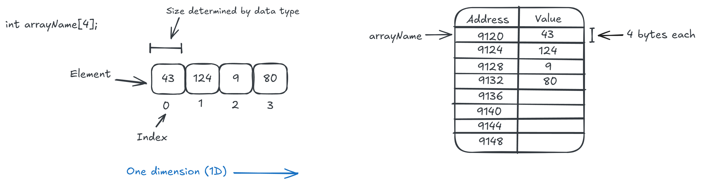
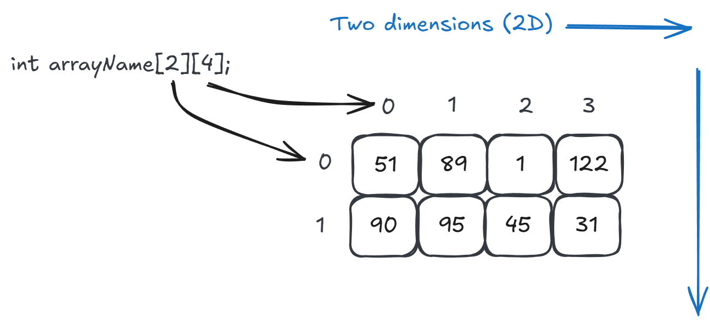
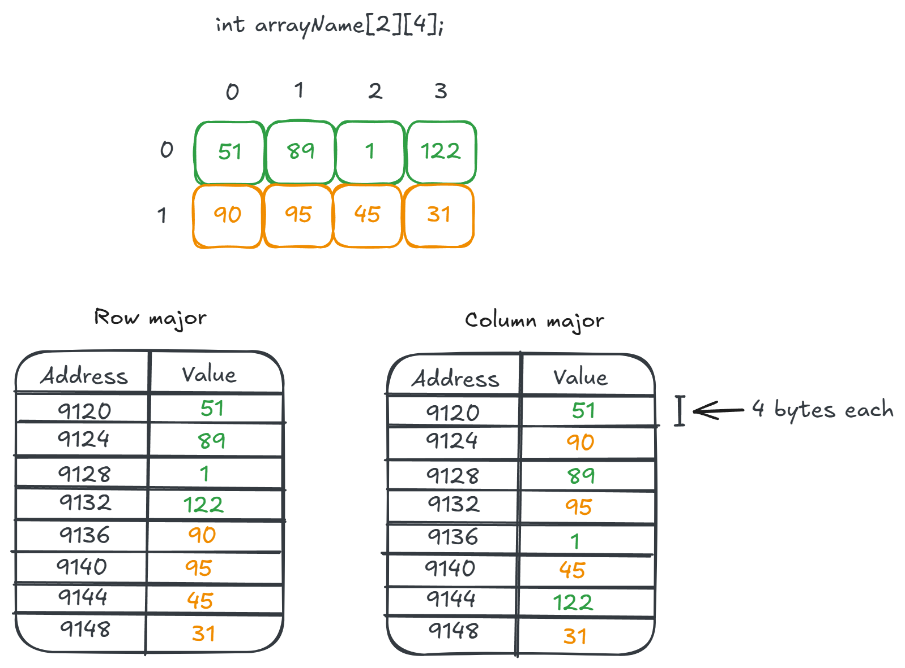

# 2D Arrays

## 1D Arrays



- `<data type> <variable name>[NUM_ELEMENTS];`
- Fixed list of elements stored side-by-side in memory.
- Size of each element determined by data type.
- All elements use same data type.
- Each element accessed by index.

## 2D Arrays



- `<data type> <variable name>[NUM_ROWS][NUM_COLS];`
- [Same as 1D] Fixed list of elements stored side-by-side in memory.
- [Same as 1D] Size of each element determined by data type.
- [Same as 1D] All elements use same data type.
- Each element accessed by two index values: row index and column index.

A 2D array is virtually the same thing as a 1D array, just initialized and accessed differently. A 2D array is treated as if it has rows and columns instead of being a single, giant row.

## Memory Layout

A 2D array can be stored in either row-major or column-major order.

- Row-major: each row stored one after another.
- Column-major: each column stored one after another.

**C uses row-major order.**



## 2D Arrays in C

Example:

```c
int grid[2][4]; // 2 rows, 4 columns
int total = 0;

// Init array with values
for (int i = 0; i < 2; i++) {
    for (int j = 0; j < 4; j++) {
        grid[i][j] = total++;
    }
}

// Loop through rows
for (int i = 0; i < 2; i++) {
    printf("Row: ");

    // Loop through columns in this row
    for (int j = 0; j < 4; j++) {
        printf("%d ", grid[i][j]);
    }

    printf("\n");
}
```

- Improvements to this discussed in class.

Processing row-by-row:

```c
// Loop through rows
for (int row = 0; row < NUM_ROWS; row++) {
    printf("Row: ");

    // Loop through columns in this row
    for (int col = 0; col < NUM_COLS; col++) {
        printf("%d ", grid[row][col]);
    }

    printf("\n");
}
```

Processing column-by-column:

```c
// Loop through columns
for (int col = 0; col < NUM_COLS; col++) {
    printf("Column: ");

    // Loop through rows in this column
    for (int row = 0; row < NUM_ROWS; row++) {
        printf("%d ", grid[row][col]);
    }

    printf("\n");
}
```

- Access to the element is done the same way in each: `grid[row][col]`.

## Homework

Complete the remaining exercises for this lecture. You must do these on your own.

**Commit and push to GitHub.**

Ensure the automated tests pass.

## Review Questions

1. Use the code below to answer the following questions.

```c
int array2d[6][3];
int j, k;
for (j = 0; j < 6; ++j)
    for (k = 0; k < 3; ++k)
        array2d[j][k] = (j + 1) * (k + 1);
```

- How many rows and columns does this array have?
- What is the value of `array2d[0][0]`?
- What is the value of `array2d[2][1]`?
- What is the value of `array2d[3][2]`?
- Is this array being processed row-by-row or column-by-column?
- Write a loop that processes the array in the opposite order.
