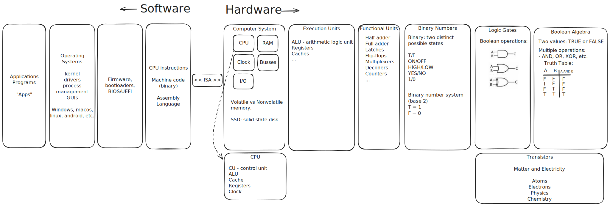
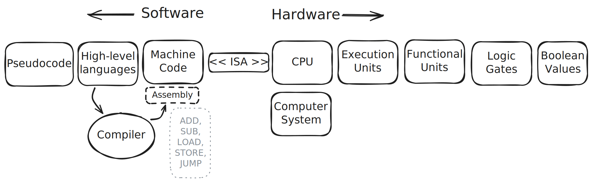

# Computer Architecture

## Highlights

- A digital computer fundamentally operates using Boolean logic, 0s and 1s, electronic circuits, and transistors.
- 
- Everything you do on a computer must be represented as a discrete number. This means all instructions sent to the CPU and all data that is processed must be encoded as a (binary) number.

- Concept of abstraction is everywhere in computer science!

- Main components of a CPU:
  - CU (control unit) - fetches and decodes instructions and schedules them for execution.
  - ALU (arithmetic logic unit) - executions mathematical and logical calculations.
  - Registers - stores pieces of data being used by instructions that are being executed. Volatile.
  - Cache - storage area inside CPU used for quick access to repeatedly used data. Not controlled by programmers. Volatile.

- Main components of a computer system:
  - CPU - brain of the computer. Executes instructions.
  - RAM - main memory location. Volatile. All programs and data must be loaded into RAM before the CPU can use it.
  - I/O - input and output devices (audio, video, keyboards, mice, controllers, etc.).
  - storage (e.g., SSD, HDD, removable storage) - **non-volatile** storage location for operating system, applications, and data.
  - clock - synchronizes and determines rate of instruction execution.
  - bus - hooks different components together and allows them to communicate.

- Volatile memory must be powered at all times; non-volatile memory retains data even if not powered.

## Translation Pipeline

- Machine code: CPU instructions encoded into binary.
- Assembly code: a more human-readable version of machine code.
  - Examples: x86, ARM, RISC-V
- High-level code: provides statements closer to human language and logic, along with various features and abstractions.
  - Examples: C, C++, C#, Python, Java, Rust
- Compiler takes high-level code and translates it into machine code.

