# Scratch

https://scratch.mit.edu

Scratch is a visual programming language made by MIT.

## UI

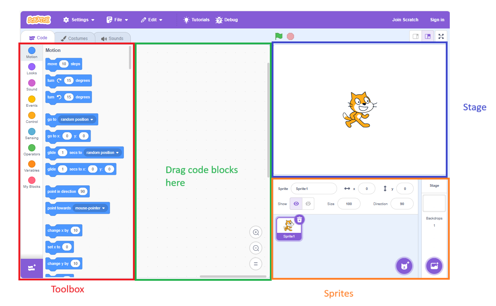

- Left pane: toolbox with different code blocks you can use. There are different types of blocks that each have different responsibilities and perform different functions.
- Center pane: code workspace. Drag blocks from the toolbox here to control the selected sprite.
- Right pane
  - Stage: the upper-right area is the stage. It is the output of your program. The characters (sprites) in your program will appear here.
  - Sprites: the lower-right area shows the characters (sprites) in your program.

The stage has a coordinate system ([source](https://en.scratch-wiki.info/wiki/Coordinate_System)):

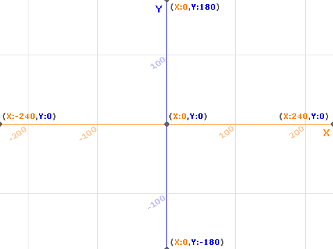

This is how characters are positioned on the stage.

## Hello, world!

- Drag a "when flag clicked" event block into your program.
- Drag a "say" block into your program and attach it under the previous block.
- Change the block to say "Hello, world!".
- Click the green flag icon above the stage to run the program.

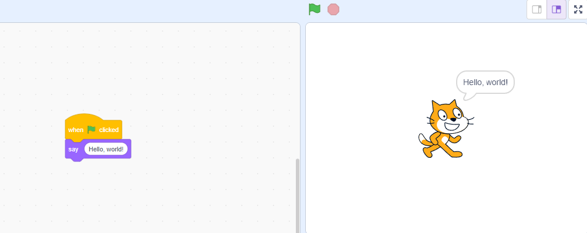

## Additional Blocks

- Add a "go to random position" block.
- Add a "play sound meow until done" block.

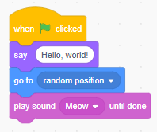

Blocks are a great example of **abstraction**. They provide seemingly simple actions, but hide the complicated behind-the-scenes details.

## Conditionals

Recall conditionals in pseudocode. We can do the same thing here.

Update the stage backdrop with two purple squares.

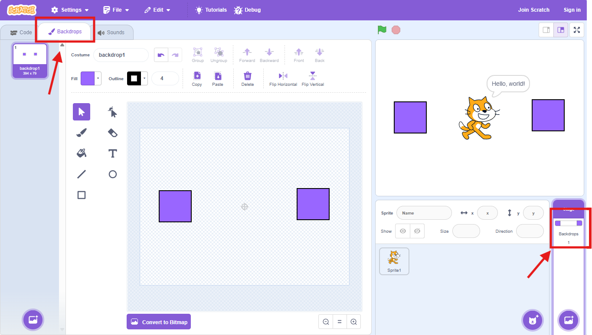

Switch back to the cat sprite.

- Add an "if...then" block and re-arrange the other blocks as shown below.
- Add "touching color \_\_\_?" sensing block to the conditional.
- Edit the "touching color" condition and pick the purple color from the stage using the eye dropper tool.

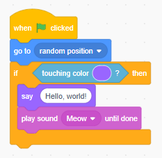

Click the green flag above the stage to run the program.

## Costumes

Create a purple costume for the cat:

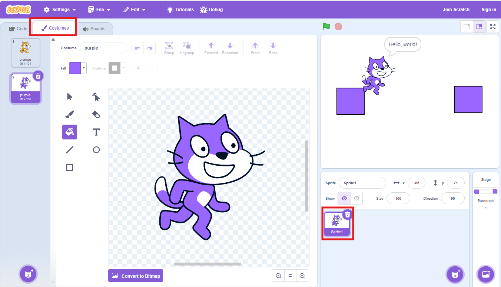

Make the cat change costumes if it hits a purple block.

- Replace the "if...then" block with an "if...then...else" block.
- Add blocks to change costume to purple/orange based on condition.
- Rearrange the blocks as shown below.

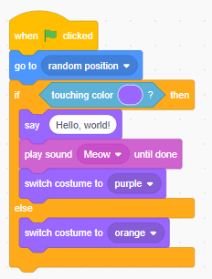

## Loops

Let's have the cat keep moving repeatedly until it touches a purple square on the stage.

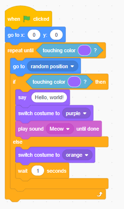

The "repeat until" block will ask the conditional question assigned to it (in this example, "is the sprite touching anything purple?").

- If the answer is "no", the blocks within the "repeat until" block will execute.
- After the list of blocks are finished, the question "is the sprite touching anything purple?" will be repeated.
- This process will continue until the answer to the question is "yes".

## Custom Blocks

You can create your own blocks.

- In the toolbox, go to **My Blocks** and click **Make a Block**.
- Type in a name for the block and click **OK**.
- Drag any instructions you want your custom block to execute under its "define" block.
- Drag your custom block into your program to use it like any other block.

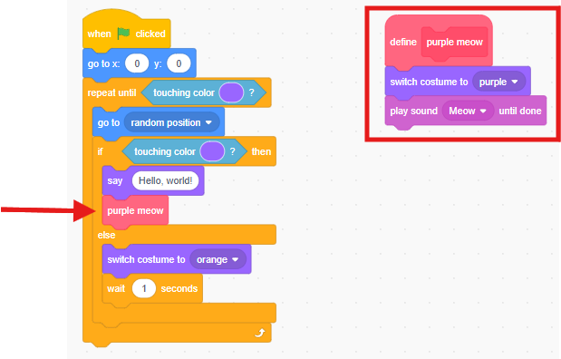

## Multiple Sprites

You can add multiple characters (sprites) to your stage.

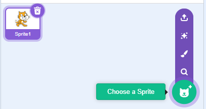

Click on a sprite to edit the code for that sprite. Each sprite has its own set of code blocks.

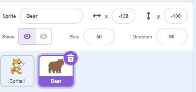
