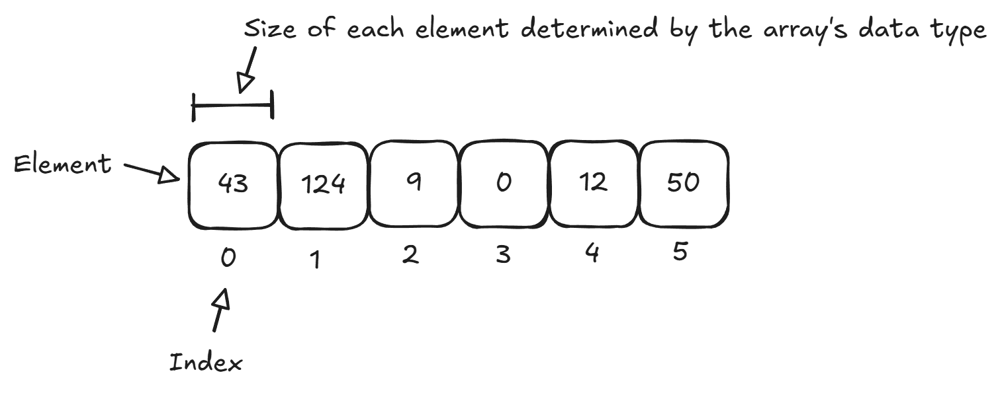

# Arrays

A single variable stores a single value. Memory is allocated for that variable depending on its data type.

An array is a series of multiple items in a row.



- Each item in the array is called an _element_.
- Each element holds a single value.
- Each element can be accessed by its _index_. This is an offset from the beginning of the array. The first element is at index 0, the second at index 1, and so on.
- Every element in the array has the same data type.
- The size of each element is determined by the data type of the array. For example, in an array of `int`, all elements are integers and take up 4 bytes per element.
- The number of elements (length of the array) is specified when the array variable is declared.

Example of declaring an array:

```cpp
int year;      // Regular integer variable (scalar value)
int years[4];  // Array of integers variable (array value)
```

Example of index values:

```cpp
/*
Elements: ___  ___  ___  ___
Index:     0    1    2    3
*/
int years[4];
```

Example of assignments:

```cpp
year = 2024;     // Assignment to regular variable

years[0] = 2024; // Assignment to index 0
years[1] = 2020; // ...
years[2] = 2016;
years[3] = 2012;
years[4] = 2008; // This is invalid - this can potentially do bad things!
```

Example of reads:

```cpp
cout << year << endl;      // Regular read
cout << years[0] << endl;  // Read at index 0
cout << years[1] << endl;  // Read at index 1
cout << years[2] << endl;  // Read at index 2
cout << years[3] << endl;  // Read at index 3
```

## Initialization

Uninitialized array values are unknown. No guarantee they will be 0 in C++.

```cpp
int years[4];
cout << years[1] << endl;
```

One way to initialize an array:

```cpp
for (int i = 0; i < 4; i++)
    years[i] = 0;
```

Initializing arrays using initializer lists:

```cpp
double sales[4] = { 1.20, 5.21, 2.99, 3.79 };
```

## Advanced Iteration/Indices

Iteration example:

```cpp
int values[6] = { 10, 20, 30, 40, 50, 60 };

for (int i = 1; i < 6; i++) {
    cout << values[i] + values[i - 1] << endl;
}
```

- Note the use of the `i` variable to compute an index value.
- Also note that `i` starts at 1 instead of 0.

Consider this example:

```cpp
// What is the value of alpha[3] after the following code executes?
int alpha[5];
alpha[0] = 5;

for (int i = 1; i < 5; ++i)
{
    if (i % 2 == 0)
        alpha[i] = alpha[i - 1] + 2;
    else
        alpha[i] = alpha[i - 1] + 3;
}
```

## Array Size

- The size of an array is fixed.
- Memory for the entire array is allocated up front.
- You cannot resize the array while the program is running.

Tip: use a named constant to store the number of elements in the array:

```cpp
const int NUM_YEARS = 25;
int years[NUM_YEARS];
```

## Standard Input

Reading in values from standard input with `cin`:

```cpp
const int NUM_VALUES = 3;
int values[NUM_VALUES];

for (int i = 0; i < NUM_VALUES; i++) {
    cout << "Enter value " << i + 1 << ": ";
    cin >> values[i];
}
```

Another example:

```cpp
int alpha[3];
cin >> alpha[0] >> alpha[1] >> alpha[2];
```

- Order is left to right. `alpha[0]` gets the first value entered.

## Arrays of Strings

Example:

```cpp
const int NUM_PLAYERS = 5;
string playerNames[NUM_PLAYERS] = { "Jordan", "Bird", "Ewing", "Barkley", "Johnson" };

for (int i = 0; i < NUM_PLAYERS; i++) {
    cout << playerNames[i] << endl;
}
```

Reading strings into array elements:

```cpp
const int NUM_PLAYERS = 5;
string playerNames[NUM_PLAYERS];

cout << "Enter player names: " << endl;
for (int i = 0; i < NUM_PLAYERS; i++) {
    cout << "Player " << i + 1 << ": ";
    getline(cin, playerNames[i]);
}
```
