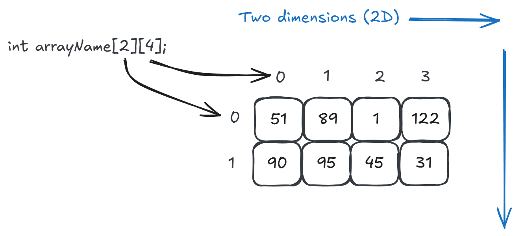

# 2D Arrays

## 1D Arrays


- `<data type> <variable name>[NUM_ELEMENTS];`
- Fixed list of elements stored side-by-side in memory.
- Size of each element determined by data type.
- All elements use same data type.
- Each element accessed by index.

## 2D Arrays



- `<data type> <variable name>[NUM_ROWS][NUM_COLS];`
- [Same as 1D] Fixed list of elements stored side-by-side in memory.
- [Same as 1D] Size of each element determined by data type.
- [Same as 1D] All elements use same data type.
- Each element accessed by two index values: row index and column index.

A 2D array is virtually the same thing as a 1D array, just initialized and accessed differently. A 2D array is treated as if it has rows and columns instead of being a single, giant row.

## Memory Layout

A 2D array can be stored in either row-major or column-major order.

- Row-major: each row stored one right after another.
- Column-major: each column stored one right after another.

**C++ uses row-major order.**


## 2D Arrays in C++

Example:

```cpp
int grid[2][4]; // 2 rows, 4 columns
int total = 0;

// Init array with values
for (int i = 0; i < 2; i++) {
    for (int j = 0; j < 4; j++) {
        grid[i][j] = total++;
    }
}

// Loop through rows
for (int i = 0; i < 2; i++) {
    cout << "Row: ";

    // Loop through columns in this row
    for (int j = 0; j < 4; j++) {
        cout << grid[i][j] << " ";
    }

    cout << endl;
}
```

- Improvements to this discussed in class.

Processing in row-major order:

```cpp
// Loop through rows
for (int row = 0; row < NUM_ROWS; row++) {
    cout << "Row: ";

    // Loop through columns in this row
    for (int col = 0; col < NUM_COLS; col++) {
        cout << grid[row][col] << " ";
    }

    cout << endl;
}
```

Processing in column-major order:

```cpp
// Loop through columns
for (int col = 0; col < NUM_COLS; col++) {
    cout << "Column: ";

    // Loop through rows in this column
    for (int row = 0; row < NUM_ROWS; row++) {
        cout << grid[row][col] << " ";
    }

    cout << endl;
}
```

- Access to the element is done the same way in each: `grid[row][col]`.
