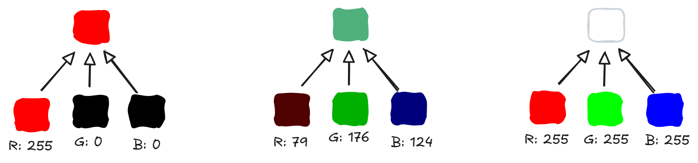
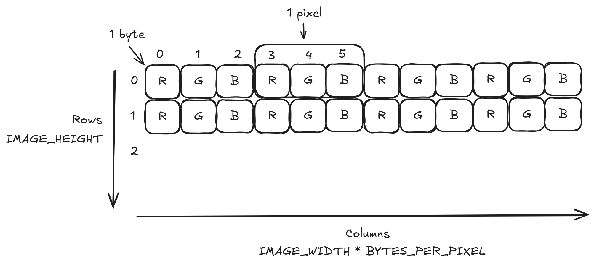

# Bitmap Images

A bitmap image can be thought of in terms of 2D arrays.

## Colors

For this example, we'll use a 24-bit image.

- This means each pixel in the image uses 24 bits (3 bytes).
- Each pixel is broken up into red, green, and blue components.
- Each color component uses 8 bits (1 byte). A byte has a range of [0, 255].



You may see color values represented using hexadecimal. For example, consider this RGB color:

- Red: 79
- Green: 176
- Blue: 124

The color values are shown as a decimal (base 10) number. When converted to hexadecimal:

- Red: 4f
- Green: b0
- Blue: 7c

You will often see this shown as `4fb07c` or `#4fb07c`. The red, green, and blue color components each represented with two hexadecimal digits.

## 2D Arrays

A 2D array can be defined to hold pixel data.



- Each row stores the color components for each pixel in that row.
  - The first three elements in the array are the red, green, and blue color components for the first pixel.
  - The next three elements in the array are the color components for the second pixels.
  - And so on.

## Code Examples

Define constants for logical image size in pixels:

```cpp
const int IMAGE_WIDTH = 50;
const int IMAGE_HEIGHT = 50;
```

Define constants for physical image size:

```cpp
const int BYTES_PER_PIXEL = 3;
const int BYTE_ROWS = IMAGE_HEIGHT;
const int BYTE_COLS = IMAGE_WIDTH * BYTES_PER_PIXEL;
```

Include the `cstdint` header to get access to the `uint8_t` data type. This type is guaranteed to be an 8-bit unsigned integer.

```cpp
#include <cstdint>
```

Create a 2D array for the pixel data:

```cpp
uint8_t pixels[BYTE_ROWS][BYTE_COLS];
```

Initialize all pixels to the same color (`#FFF000` in this example):

```cpp
// Loop through rows of pixels
for (int row = 0; row < BYTE_ROWS; row++) {

    // Loop through all byes for this row of pixels
    for (int col = 0; col < BYTE_COLS; col += 3) {

        // Set the RGB byte values for this pixel
        pixels[row][col] = 0xFF;     // red
        pixels[row][col + 1] = 0xF0; // green
        pixels[row][col + 2] = 0x00; // blue
    }
}
```

Save using the `stb_image` library:

```cpp
// Save as bmp image file
stbi_write_bmp("image.bmp", IMAGE_WIDTH, IMAGE_HEIGHT, BYTES_PER_PIXEL, pixels);
```
